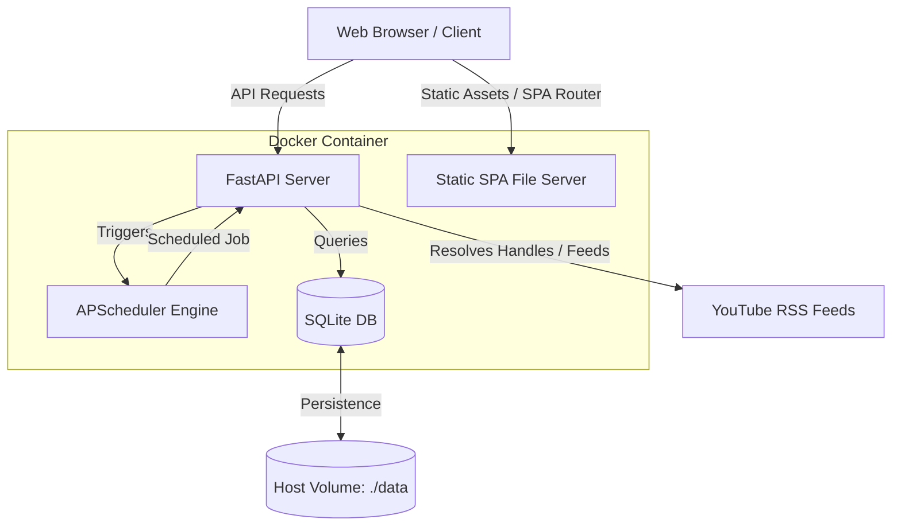

# YouTube-Watcher Developer Guide

This guide is designed for developers (and AI agents) working on the YouTube-Watcher codebase. It documents the architecture, database models, key features, codebase conventions, and deployment workflows.

---

## 1. Project Architecture

YouTube-Watcher is a self-hosted, Docker-based application with optional authentication. In production, a single container hosts both the Python/FastAPI backend and the compiled React/TypeScript frontend.



### Main Directories
- [backend/app/](backend/app): FastAPI application source code.
- [frontend/src/](frontend/src): React frontend application source code.
- [plans/](plans): Architectural planning documents.
- [scripts/](scripts): Development utilities (API key, password hashing, and versioning scripts).

---

## 2. Backend Implementation Details

### Database Schema & Models
The application uses SQLite as its database engine. DB files are stored in `./data/youtube-watcher.db`. The models are defined in `backend/app/models/`:

1. **[Channel](backend/app/models/channel.py)**: Represents a tracked YouTube channel.
   - `id`: UUID (String, PK)
   - `youtube_channel_id`: Unique YouTube string ID (`UC...`)
   - `name`: Channel display name
   - `rss_url`: Cached RSS feed URL
   - `youtube_url`: User-facing channel home URL
   - `thumbnail_url`: Channel avatar URL
   - `last_checked`: Datetime the channel was last crawled
   - `last_video_id`: YouTube ID of the last fetched video (used for delta comparisons)

2. **[Video](backend/app/models/video.py)**: Represents a video.
   - `id`: UUID (String, PK)
   - `youtube_video_id`: Unique YouTube video ID (11 characters)
   - `channel_id`: FK to channels table (SET NULL on delete)
   - `channel_youtube_id`, `channel_name`, `channel_thumbnail_url`: Denormalized channel info for fast retrieval and detached video records (when a channel is removed)
   - `title`: Video title
   - `description`: Video description
   - `thumbnail_url`: Video thumbnail URL
   - `video_url`: Watch link
   - `published_at`: Upload datetime
   - `status`: Enum string (`inbox`, `saved`, `discarded`)
   - `saved_at`, `discarded_at`: Actions timestamps
   - `is_short`: Boolean indicating if the video is a YouTube Short
   - `is_short_detected_at`: Timestamp of last Shorts detection check

3. **[Setting](backend/app/models/setting.py)**: Global settings singleton (always `id = '1'`).
   - `http_timeout`: Timeout in seconds for crawling feeds
   - `backup_enabled`, `backup_schedule`, `backup_time`, `backup_format`, `backup_retention_days`: Scheduled backup options
   - `last_backup_at`, `last_backup_status`, `last_backup_error`: Backup metadata
   - `auto_refresh_enabled`, `auto_refresh_interval`: Automatic feed refresh configurations
   - `auto_detect_shorts`: Whether to auto-detect Shorts during video imports
   - `last_refresh_at`, `last_refresh_status`, `last_refresh_error`: Feed refresh metadata

### Custom Exception Handling
The API returns standardized JSON error responses. If an exception occurs, it is captured by FastAPI exception handlers defined in [backend/app/error_handlers.py](backend/app/error_handlers.py) and mapped to an `ErrorResponse` schema containing:
- `error.code`: A developer-friendly string (e.g. `NOT_FOUND`, `VALIDATION_ERROR`, `DATABASE_ERROR`)
- `error.message`: A descriptive message
- `error.details`: Structured diagnostic metadata
- `timestamp`, `path`, and `status_code`

Custom exceptions inherit from `AppException` in [backend/app/exceptions.py](backend/app/exceptions.py):
- `NotFoundError`: Resource doesn't exist (HTTP 404)
- `AlreadyExistsError`: Resource unique constraint violation (HTTP 409)
- `ValidationError`: Input request fails format requirements (HTTP 400)
- `ExternalServiceError`: Communication with YouTube/RSS failed (HTTP 502)
- `DatabaseError`: DB transaction failure (HTTP 500)

---

## 3. Key Feature Deep-Dive

### Optional Authentication
Managed in [backend/app/auth.py](backend/app/auth.py) and configured in [backend/app/config.py](backend/app/config.py):
- **Toggled by**: `AUTH_ENABLED` environment variable.
- **Hashing**: Uses standard `hashlib` with PBKDF2-SHA256 and salt size of 16 bytes with 100,000 iterations. Salt + hash are combined and URL-safe Base64 encoded.
- **Authentication Methods**:
  1. **JWT Session Token**: Created on login (`create_access_token`) and validated on subsequent requests via a Bearer header.
  2. **API Key Header**: Checks the `X-API-Key` header against the `API_KEY` environment variable. This allows programmatic API consumers to bypass login.
- **Implementation**: Wrapped in a FastAPI dependency (`require_auth`) and attached to API routers. If auth is disabled, the dependency returns immediately.

### YouTube URL Parsing & Channel ID Scraping
Managed in [backend/app/services/youtube_utils.py](backend/app/services/youtube_utils.py):
- Supports parsing Handle (`@username`), Custom (`/c/channelname`), User (`/user/username`), and direct ID URLs.
- For handle, custom, and user URLs, the backend scrapes the HTML page.
- **EU Cookie Consent Bypass**: Scrapers attach a browser-like `User-Agent` and a predefined consent cookie (`SOCS` and `CONSENT`) to bypass EU cookie consent screens which would otherwise block page crawls.
- If scraping fails or redirects to consent domains, the parser raises an error explaining the issue.

### YouTube Shorts Detection
Managed in [backend/app/services/shorts_detector.py](backend/app/services/shorts_detector.py):
- **HTTP status checks**: Detects Shorts by making a lightweight HTTP `GET` (with `follow_redirects=False`) to YouTube's `/shorts/{video_id}` endpoint.
  - **HTTP 200**: Video is a YouTube Short.
  - **HTTP 303 (Redirect)**: Redirects to `/watch?v=...`, meaning the video is a regular video.
  - **HTTP 404**: Video is unavailable or deleted.
- Supports concurrent batch checks via `asyncio.Semaphore` to limit concurrency (default: 5 concurrent connections) to prevent rate limits.

### Play as Playlist
Managed in [frontend/src/utils/playlist.ts](frontend/src/utils/playlist.ts):
- Creates a client-side temporary playlist from selected video IDs.
- Redirects the browser in a new tab to YouTube's watch videos service endpoint:
  `https://www.youtube.com/watch_videos?video_ids=ID1,ID2,ID3...`
- **Constraint**: The YouTube URL endpoint caps the maximum length at ~50 videos. Playlists exceeding this limit are truncated, and a warning is logged.

### QuickPlay
Managed in [frontend/src/pages/QuickPlay.tsx](frontend/src/pages/QuickPlay.tsx):
- Loads the oldest 50 saved regular videos and the oldest 50 saved Shorts as independent batches.
- Each batch can be opened as a temporary YouTube playlist.
- Independent removal controls move the currently displayed batch to Recently Deleted through the existing bulk-discard API.
- After a successful removal, only the affected section reloads from the oldest remaining saved items.

### Scheduled Backups and Auto-Refresh
Managed in [backend/app/services/backup_scheduler.py](backend/app/services/backup_scheduler.py) and [backend/app/services/feed_refresh_scheduler.py](backend/app/services/feed_refresh_scheduler.py):
- Leverages `APScheduler` to trigger background jobs inside the FastAPI application lifespan.
- **Auto-Refresh**: Resolves RSS XML files for tracked channels on configurable intervals (`1h`, `6h`, `12h`, `24h`) and imports new videos to the inbox.
- **Backups**: Supports JSON exports, SQLite database files (gzip-compressed), or both.
  - Backups are stored in `/app/data/backups/`.
  - Automatic retention sweeps purge backups older than the configured threshold (default: 30 days).
  - To prevent database locking, JSON and database backup operations are dispatched to synchronous worker threads via `asyncio.to_thread`.

### Progressive Web App (PWA) Support
Configured in Vite (`vite.config.ts`) and served by FastAPI (`backend/app/main.py`):
- PWA is configured using `vite-plugin-pwa` in the frontend build pipeline.
- For production containers (where FastAPI serves static files), standard routers mount files to `/assets`.
- Since service workers require scope isolation, custom API routes are added in FastAPI to serve PWA assets from the site root:
  - `/sw.js` (served with `Cache-Control: no-cache` and `Service-Worker-Allowed: /`)
  - `/manifest.webmanifest` (served as `application/manifest+json`)
  - `/workbox-{workbox_id}.js` (served as `application/javascript`)

---

## 4. Development Workflow

### Conventions
- **Dates**: Always use ISO 8601 format for JSON date serialization.
- **UUIDs**: All primary keys in the database are UUID strings.
- **Testing**: Always implement mock fixtures for network operations.
- **Compose**: Use the space-separated `docker compose` CLI command rather than legacy hyphenated `docker-compose`.

### Testing Suite
Backend tests use `pytest` + `pytest-asyncio` + `pytest-mock`.
- **Database isolation**: Tests run against an in-memory SQLite database using `StaticPool` to maintain database state across connections while preventing file-locking conflicts.
- **Fixtures**: Defined in [backend/tests/conftest.py](backend/tests/conftest.py).
- **Run command (once dependencies are installed)**:
  ```bash
  cd backend
  pytest
  ```

### Release Versioning
The project uses date-based tags (`vYYYY-MM-DD`). The frontend package metadata uses the equivalent npm-compatible dotted form (`YYYY.M.D`), while the health endpoint reports `YYYY-MM-DD`.
- **Update versions**:
  ```bash
  ./scripts/update_version.sh vYYYY-MM-DD
  ```
- **Commit, tag, and push**:
  ```bash
  git add frontend/package.json frontend/package-lock.json backend/app/main.py
  git commit -m "chore: bump version to YYYY-MM-DD"
  git tag vYYYY-MM-DD
  git push origin main
  git push origin vYYYY-MM-DD
  ```
- **Draft the GitHub release**:
  ```bash
  gh release create vYYYY-MM-DD --draft --title "vYYYY-MM-DD - Short description" --notes-file release-notes.md
  ```
