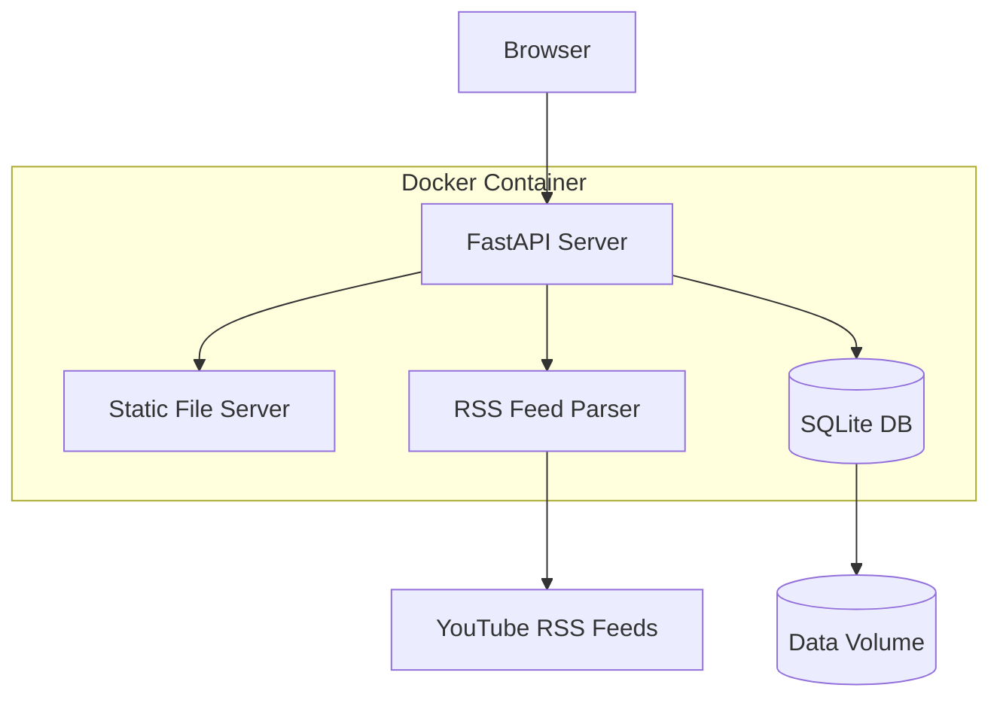
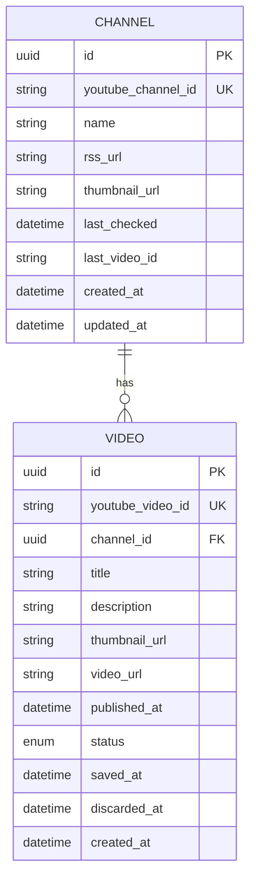

# YouTube-Watcher Development Plan

## Project Overview

YouTube-Watcher is a self-hosted, Docker-based web application that helps users manage YouTube content discovery. It monitors a curated list of YouTube channels via RSS feeds, presents new videos in an inbox-style interface for triage, and maintains a personal "watch later" list with filtering and sorting capabilities.

## Key Requirements Summary

| Requirement | Decision |
|-------------|----------|
| Data Source | YouTube RSS Feeds (no API key required) |
| User Model | Single-user, no authentication |
| Video Check Trigger | User-initiated only |
| Deployment | Docker / docker-compose |
| Scope | MVP with core features |

---

## Recommended Technology Stack

### Backend: Python + FastAPI
- **Why**: Lightweight, excellent async support for concurrent RSS feed fetching, automatic OpenAPI documentation, type hints with Pydantic for data validation
- **Key Libraries**:
  - `fastapi` - Web framework
  - `feedparser` - RSS feed parsing
  - `httpx` - Async HTTP client
  - `sqlalchemy` - ORM for database operations
  - `alembic` - Database migrations

### Frontend: React + TypeScript
- **Why**: Component-based architecture ideal for inbox/list UIs, strong typing, extensive ecosystem
- **Key Libraries**:
  - `react-router` - Client-side routing
  - `react-query` or `SWR` - Data fetching and caching
  - `tailwindcss` - Utility-first CSS framework for rapid UI development

### Database: SQLite
- **Why**: Perfect for single-user applications - no separate server needed, zero configuration, easy backup (just copy the file), lightweight
- **Tables Needed**: Channels, Videos, with proper indexing for filtering/sorting
- **Storage**: Single `.db` file mounted as a Docker volume for persistence

### Containerization: Docker (Single Container)
- **Single container**: FastAPI serves both API and static frontend files
- **Simpler deployment**: One image, one container, one command
- **Volumes**: SQLite database file persistence

---

## System Architecture



**How it works:**
- FastAPI serves the React app as static files from `/`
- API endpoints are available at `/api/*`
- Single port (8000) for everything

---

## Data Model



### Video Status Enum
- `inbox` - New video awaiting user decision
- `saved` - User saved the video to watch later
- `discarded` - User dismissed the video

---

## Core Features - MVP

### 1. Channel Management
- Add a YouTube channel by URL or channel ID
- View list of tracked channels
- Remove a channel from tracking
- When adding a new channel: fetch and display up to last 15 videos as inbox items

### 2. Video Inbox
- Display all videos with status = inbox
- For each video show: thumbnail, title, channel name, publish date
- Actions per video: Save or Discard
- Bulk actions: Save all, Discard all
- Manual Refresh All button to check all channels for new videos

### 3. Saved Videos List
- Display all videos with status = saved
- Filtering options:
  - By channel
- Sorting options:
  - By publish date (ascending/descending)
  - By saved date (ascending/descending)
- Action: Mark as watched / Remove from list

### 4. Direct URL Save
- Input field to paste any YouTube video URL
- Extracts video metadata and saves directly to saved list
- Works for videos from any channel (not just tracked ones)

---

## API Endpoints Design

### Channels
| Method | Endpoint | Description |
|--------|----------|-------------|
| GET | `/api/channels` | List all tracked channels |
| POST | `/api/channels` | Add a new channel |
| DELETE | `/api/channels/{id}` | Remove a channel |
| POST | `/api/channels/{id}/refresh` | Check single channel for new videos |
| POST | `/api/channels/refresh-all` | Check all channels for new videos |

### Videos
| Method | Endpoint | Description |
|--------|----------|-------------|
| GET | `/api/videos/inbox` | Get inbox videos |
| GET | `/api/videos/saved` | Get saved videos with filter/sort params |
| POST | `/api/videos/{id}/save` | Move video to saved |
| POST | `/api/videos/{id}/discard` | Discard a video |
| POST | `/api/videos/bulk-save` | Bulk save videos |
| POST | `/api/videos/bulk-discard` | Bulk discard videos |
| POST | `/api/videos/from-url` | Save video from direct YouTube URL |
| DELETE | `/api/videos/{id}` | Remove from saved list |

---

## UI Wireframes - Conceptual Layout

### Main Navigation
```
+--------------------------------------------------+
|  YouTube Watcher                    [+ Add URL]  |
+--------------------------------------------------+
|  [Inbox (5)]  |  [Saved (23)]  |  [Channels (8)] |
+--------------------------------------------------+
```

### Inbox View
```
+--------------------------------------------------+
|  Inbox (5 new videos)        [Refresh] [Actions] |
+--------------------------------------------------+
| +----------------------------------------------+ |
| | [thumb] Video Title                          | |
| |         Channel Name • 2 hours ago           | |
| |                          [Save] [Discard]    | |
| +----------------------------------------------+ |
| | [thumb] Another Video Title                  | |
| |         Another Channel • 1 day ago          | |
| |                          [Save] [Discard]    | |
| +----------------------------------------------+ |
```

### Saved Videos View
```
+--------------------------------------------------+
|  Saved Videos                                    |
|  Filter: [All Channels ▼]  Sort: [Saved Date ▼]  |
+--------------------------------------------------+
| +----------------------------------------------+ |
| | [thumb] Saved Video Title                    | |
| |         Channel Name • Saved 3 days ago      | |
| |                              [Watch] [Remove]| |
| +----------------------------------------------+ |
```

---

## Project Structure

```
youtube-watcher/
├── Dockerfile                 # Single container build
├── docker-compose.yml         # Simple single-service config
├── .env.example
├── README.md
├── agents.md                  # AI pair programmer context file
├── data/                      # SQLite database (gitignored)
│   └── .gitkeep
│
├── backend/
│   ├── requirements.txt
│   ├── alembic.ini
│   ├── alembic/
│   │   └── versions/
│   └── app/
│       ├── __init__.py
│       ├── main.py            # Serves API + static frontend
│       ├── config.py
│       ├── database.py
│       ├── models/
│       │   ├── __init__.py
│       │   ├── channel.py
│       │   └── video.py
│       ├── schemas/
│       │   ├── __init__.py
│       │   ├── channel.py
│       │   └── video.py
│       ├── routers/
│       │   ├── __init__.py
│       │   ├── channels.py
│       │   └── videos.py
│       └── services/
│           ├── __init__.py
│           ├── rss_parser.py
│           └── youtube_utils.py
│
├── frontend/
│   ├── package.json
│   ├── tsconfig.json
│   ├── vite.config.ts
│   ├── tailwind.config.js
│   ├── postcss.config.js
│   ├── index.html
│   └── src/
│       ├── main.tsx
│       ├── App.tsx
│       ├── index.css
│       ├── api/
│       │   └── client.ts
│       ├── components/
│       │   ├── layout/
│       │   ├── channel/
│       │   ├── video/
│       │   └── common/
│       ├── pages/
│       │   ├── Inbox.tsx
│       │   ├── Saved.tsx
│       │   └── Channels.tsx
│       ├── hooks/
│       └── types/
│
└── plans/
    ├── development-plan.md
    └── plan.md
```

---

## Development Phases

### Phase 1: Project Setup & Infrastructure
- Initialize project structure
- Set up single-container Docker configuration
- Configure docker-compose for easy development
- Set up SQLite database with initial schema
- Configure Alembic for migrations
- Basic FastAPI application scaffold (serves API + static files)
- Basic React application with routing

### Phase 2: Core Backend Development
- Implement database models (Channel, Video)
- Create RSS feed parsing service
- Implement YouTube URL parsing utilities
- Build channel management API endpoints
- Build video management API endpoints
- Add proper error handling and validation

### Phase 3: Frontend - Channel Management
- Create channel list component
- Implement add channel form/modal
- Add channel deletion functionality
- Display channel metadata (name, thumbnail, video count)

### Phase 4: Frontend - Video Inbox
- Create inbox page layout
- Build video card component
- Implement save/discard actions
- Add bulk actions (save all, discard all)
- Implement refresh functionality

### Phase 5: Frontend - Saved Videos
- Create saved videos page
- Implement filter by channel dropdown
- Add sorting controls
- Build watch/remove actions
- Implement direct URL save feature

### Phase 6: Polish & Testing
- Add loading states and error handling
- Implement empty states for lists
- Add confirmation dialogs for destructive actions
- Manual testing of all workflows
- Bug fixes and refinements
- Documentation updates

---

## AI Pair Programmer Documentation

### agents.md File

The project maintains an `agents.md` file at the repository root that serves as a living context document for AI pair programmers (like Claude, GPT, Copilot, etc.). This file should be kept updated throughout development.

**Purpose:**
- Provides AI assistants with current project context and state
- Documents recent changes and development decisions
- Lists known issues, TODOs, and areas needing attention
- Describes the current architecture and any deviations from the original plan

**Required Sections:**

```markdown
# YouTube-Watcher - AI Agent Context

## Project Overview
Brief description of the project and its current state.

## Current Development Status
- What phase of development we're in
- What features are complete vs in-progress
- Any blockers or pending decisions

## Recent Changes
Chronological list of recent significant changes with dates.

## Architecture Notes
Any important architectural decisions or patterns being used.

## Known Issues & TODOs
- Current bugs or issues being worked on
- Technical debt items
- Planned improvements

## Development Commands
Quick reference for common development tasks.

## Key Files
List of important files and their purposes for quick navigation.
```

**Update Guidelines:**
- Update after completing any significant feature or change
- Document any deviations from the original plan
- Note any new patterns or conventions established
- Keep the "Recent Changes" section current (last 10-15 entries)
- Remove outdated information to keep the file concise

---

## YouTube RSS Feed Reference

YouTube provides RSS feeds for channels in this format:
```
https://www.youtube.com/feeds/videos.xml?channel_id=CHANNEL_ID
```

Each feed entry contains:
- Video ID
- Title
- Author/Channel name
- Published date
- Video thumbnail URL
- Description/Summary

To get the channel ID from a channel URL, we may need to:
1. Parse `/channel/UC...` URLs directly
2. For custom URLs (`/@username` or `/c/name`), fetch the page and extract the channel ID

---

## Future Enhancements (Post-MVP)

These features are out of scope for MVP but documented for future consideration:

- **Scheduled Checks**: Background task to automatically check for new videos
- **Search**: Full-text search within saved video titles/descriptions
- **Tags/Categories**: User-defined tags for organizing saved videos
- **Watched Status**: Track which saved videos have been watched
- **Export**: Export saved videos list to various formats
- **Import/Export Channels**: Backup and restore channel subscriptions
- **Browser Extension**: Quick-save videos while browsing YouTube
- **Mobile Responsive**: Optimize UI for mobile devices
- **Dark Mode**: Theme switching support
- **Notifications**: Optional browser notifications for new videos

---

## Getting Started (For Development)

Once the project is set up, the development workflow will be:

```bash
# Clone and setup
git clone <repository>
cd youtube-watcher

# Copy environment template
cp .env.example .env

# Start the application
docker-compose up --build

# Access the application (single port)
# Application: http://localhost:8000
# API Docs: http://localhost:8000/docs

# Database is stored in ./data/youtube-watcher.db
```

### Development Mode

For local development without Docker:

```bash
# Backend (in one terminal)
cd backend
pip install -r requirements.txt
uvicorn app.main:app --reload --port 8000

# Frontend (in another terminal)
cd frontend
npm install
npm run dev  # Runs on port 5173 with proxy to backend
```

---

## Summary

This plan outlines an MVP for YouTube-Watcher with:

- **Simple, focused scope**: Channel tracking, inbox triage, saved videos management
- **No external API dependencies**: Uses YouTube RSS feeds
- **Single-container deployment**: One Docker image, one command to run
- **Extensible architecture**: Clean separation for future enhancements

The technology choices prioritize developer productivity, maintainability, and ease of deployment while providing a solid foundation for future feature additions.