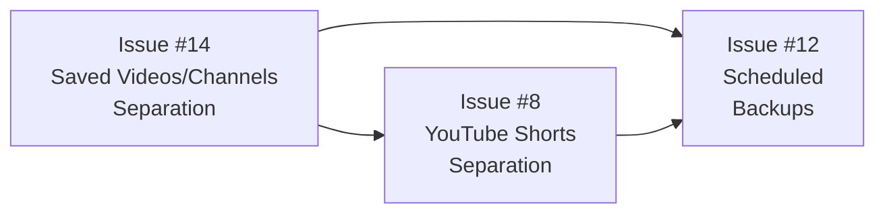

# Enhancement Implementation Plan - Overview

## Executive Summary

This document provides an overview of three enhancement issues for the YouTube Watcher application. Each enhancement has its own detailed implementation plan document.

| Issue | Title | Priority | Complexity | Document |
|-------|-------|----------|------------|----------|
| #14 | Saved Videos / Channels Separation | High | Medium-High | [issue-14-saved-videos-channels-separation.md](issue-14-saved-videos-channels-separation.md) |
| #12 | Scheduled Backups | Medium | Medium | [issue-12-scheduled-backups.md](issue-12-scheduled-backups.md) |
| #8 | YouTube Shorts Separation | Medium | Low-Medium | [issue-8-youtube-shorts-separation.md](issue-8-youtube-shorts-separation.md) |

---

## Priority and Dependency Analysis

### Recommended Implementation Order



**1. Issue #14 - Saved Videos / Channels Separation (First)**
- **Rationale**: This is the highest priority and involves core data model changes
- **Dependencies**: None
- **Impact**: Changes to Video model affect other issues

**2. Issue #8 - YouTube Shorts Separation (Second)**
- **Rationale**: Builds on the Video model, simpler changes
- **Dependencies**: Should be implemented after #14 if both are done together, as the Video model migration should be coordinated
- **Impact**: Adds new field and filter capability

**3. Issue #12 - Scheduled Backups (Third)**
- **Rationale**: Independent feature, lower priority
- **Dependencies**: None technically, but should come after core features stabilize
- **Impact**: Adds new service and settings

### Database Migration Coordination

If implementing multiple issues together, create a single coordinated migration:

```python
# Combined migration for #14 and #8
def upgrade() -> None:
    # Issue #14: Add channel info columns
    op.add_column('videos', sa.Column('channel_youtube_id', sa.String(), nullable=True))
    op.add_column('videos', sa.Column('channel_name', sa.String(), nullable=True))
    op.add_column('videos', sa.Column('channel_thumbnail_url', sa.String(), nullable=True))
    
    # Issue #8: Add Shorts detection column
    op.add_column('videos', sa.Column('is_short', sa.Boolean(), server_default='false', nullable=False))
    
    # Create indexes
    op.create_index('ix_videos_channel_youtube_id', 'videos', ['channel_youtube_id'])
    op.create_index('ix_videos_is_short', 'videos', ['is_short'])
    
    # Issue #14: Change foreign key behavior
    op.drop_constraint('videos_channel_id_fkey', 'videos', type_='foreignkey')
    op.create_foreign_key(
        'videos_channel_id_fkey',
        'videos', 'channels',
        ['channel_id'], ['id'],
        ondelete='SET NULL'
    )
    
    # Issue #14: Populate channel info from existing relationships
    op.execute("""
        UPDATE videos 
        SET channel_youtube_id = channels.youtube_channel_id,
            channel_name = channels.name,
            channel_thumbnail_url = channels.thumbnail_url
        FROM channels 
        WHERE videos.channel_id = channels.id
    """)
```

---

## Cross-Cutting Concerns

### Security
- **Issue #12**: Backup files should not be publicly accessible
- **Issue #14**: No new security concerns
- **Issue #8**: No new security concerns

### Performance
- **Issue #14**: New index on `channel_youtube_id` for efficient filtering
- **Issue #8**: New index on `is_short`; batch detection should be throttled
- **Issue #12**: Backup operations should run during low-usage periods

### UX Considerations
- **Issue #14**: Seamless transition for existing users; saved videos preserved on channel deletion
- **Issue #8**: Clear visual distinction for Shorts; intuitive filter controls
- **Issue #12**: Non-intrusive backup status; clear configuration UI

### Data Migration
- **Issue #14**: Existing videos get channel info populated from current channel relationships
- **Issue #8**: Existing videos default to `is_short=False`; users can run detection
- **Issue #12**: No data migration needed; new settings with defaults

---

## Implementation Timeline

### Phase 1: Core Data Model Changes
- Implement Issue #14 backend changes
- Implement Issue #8 backend changes
- Create coordinated database migration
- Run tests to verify model changes

### Phase 2: Backend Services
- Complete Issue #14 API changes
- Complete Issue #8 Shorts detection service
- Add Issue #12 backup service infrastructure

### Phase 3: Frontend Updates
- Update types and API client for all issues
- Implement Issue #14 Saved page filter changes
- Implement Issue #8 Inbox Shorts filter and badges
- Implement Issue #12 backup settings UI

### Phase 4: Testing and Polish
- End-to-end testing of all features
- Performance testing
- Documentation updates

---

## Risk Assessment

### Issue #14 - Saved Videos / Channels Separation
| Risk | Impact | Likelihood | Mitigation |
|------|--------|------------|------------|
| Data loss during migration | High | Low | Backup before migration; test thoroughly |
| Breaking existing filter functionality | Medium | Low | Provide deprecated param support |
| Channel deletion confusion | Medium | Medium | Clear UI messaging about behavior change |

### Issue #12 - Scheduled Backups
| Risk | Impact | Likelihood | Mitigation |
|------|--------|------------|------------|
| Scheduler fails silently | Medium | Medium | Status monitoring; error logging |
| Disk space exhaustion | High | Low | Retention policy; cleanup job |
| Backup file corruption | High | Low | Verify backup integrity; multiple formats |

### Issue #8 - YouTube Shorts Separation
| Risk | Impact | Likelihood | Mitigation |
|------|--------|------------|------------|
| Inaccurate Shorts detection | Low | Medium | Multiple detection methods; manual override |
| Performance impact from detection | Medium | Low | Batch processing; caching |
| API rate limiting from detection | Medium | Medium | Rate limiting; incremental detection |

---

## Summary of Changes by Component

### Backend

| Component | Issue #14 | Issue #12 | Issue #8 |
|-----------|-----------|-----------|----------|
| **Models** | Add channel_youtube_id, channel_name, channel_thumbnail_url to Video; change FK ondelete | Add backup settings to Setting | Add is_short to Video |
| **Schemas** | Add ChannelFilterOption; update VideoResponse | Add BackupSettings, BackupStatus, ManualBackupRequest | Update VideoResponse with is_short |
| **Services** | Update VideoService.get_videos | Add BackupService, BackupScheduler | Add ShortsDetector |
| **Routers** | Update /videos/saved; add /videos/saved/channels | Add /backup/* endpoints | Update /videos/inbox; add /videos/detect-shorts* |
| **Tests** | Test channel separation; test filter | Test backup service; test scheduler | Test Shorts detection |

### Frontend

| Component | Issue #14 | Issue #12 | Issue #8 |
|-----------|-----------|-----------|----------|
| **Types** | Add ChannelFilterOption; update SavedVideosParams | Add backup types | Add is_short to Video; add ShortsFilter |
| **API Client** | Add getSavedChannels | Add backupApi methods | Update getInbox; add detect methods |
| **Hooks** | Add useSavedVideoChannels | Add useBackup* hooks | Update useInboxVideos; add useDetectShorts |
| **Components** | Update Saved page filter | Add BackupSettingsSection | Add ShortsBadge, ShortsFilterToggle |
| **Pages** | Update Saved.tsx | Update Settings.tsx | Update Inbox.tsx |

### Database

| Migration | Issue #14 | Issue #12 | Issue #8 |
|-----------|-----------|-----------|----------|
| **New Columns** | videos.channel_youtube_id, channel_name, channel_thumbnail_url | settings.backup_* columns | videos.is_short |
| **Indexes** | ix_videos_channel_youtube_id | None | ix_videos_is_short |
| **Constraints** | Change FK ondelete to SET NULL | None | None |
| **Data Migration** | Populate channel info from existing | None | None |

---

## Detailed Implementation Plans

For complete implementation details, see the individual plan documents:

1. **[Issue #14 - Saved Videos / Channels Separation](issue-14-saved-videos-channels-separation.md)**
   - Decouples saved videos from tracked channels
   - Preserves videos when channels are deleted
   - Independent channel filtering for saved videos

2. **[Issue #12 - Scheduled Backups](issue-12-scheduled-backups.md)**
   - Automated backup scheduling with APScheduler
   - Multiple backup formats: JSON and database
   - Backup status monitoring and retention policies

3. **[Issue #8 - YouTube Shorts Separation](issue-8-youtube-shorts-separation.md)**
   - Automatic Shorts detection
   - Visual badges for Shorts
   - Filter to view only Shorts or regular videos

---

## Conclusion

These three enhancements will significantly improve the YouTube Watcher application:

- **Issue #14** provides data independence and better user experience for managing saved content
- **Issue #12** adds data protection through automated backups
- **Issue #8** improves content management with Shorts identification

The recommended implementation order prioritizes core data model changes first, followed by features that build on those changes, and finally independent features. This approach minimizes conflicts and allows for coordinated database migrations.

All implementation plans include detailed code examples, test strategies, and edge case considerations to enable LLM-based implementation without additional guidance.
