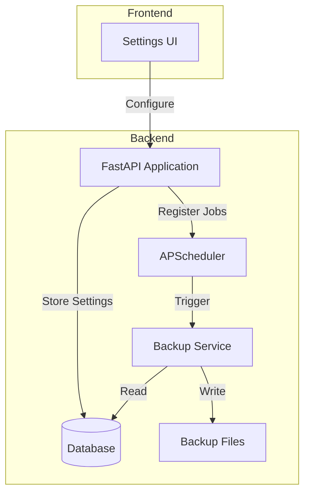

# Issue #12 - Scheduled Backups

## Implementation Plan

**GitHub Issue:** [#12 - Add scheduled backups](https://github.com/thejudge22/youtube-watcher/issues/12)
**Priority:** Medium
**Complexity:** Medium

---

## 1. Overview and Objectives

### Problem Statement
Currently, users can manually export their data via the Settings page, but there's no automated backup mechanism. Users risk losing data if they forget to manually export or if the database becomes corrupted.

### User Story
As a user, I want to:
1. Configure automatic backups on a schedule (daily, weekly, etc.)
2. Have backups stored in a designated location
3. Choose the backup format (JSON export or database file copy)
4. See when the last backup occurred
5. Optionally limit the number of backups kept (rotation)

### Success Criteria
- Backups run automatically based on configured schedule
- Multiple backup format options available
- Backup configuration persists across restarts
- Clear UI for configuring backup settings
- Backup status visible in the application

---

## 2. Technical Approach

### Architecture Decision: Background Task Scheduler

Use APScheduler for Python-based scheduled tasks that persist across container restarts.



### Backup Options
1. **JSON Export**: Uses existing export functionality, stores channels and saved videos
2. **Database Copy**: Direct copy of SQLite database file
3. **Both**: Creates both JSON and database backups

### Storage Location
Backups stored in `/app/data/backups/` directory (inside Docker volume)

---

## 3. Backend Implementation

### 3.1 Database Migration - Backup Settings

**File:** `backend/alembic/versions/YYYYMMDD_HHMM_add_backup_settings.py`

```python
"""Add backup settings to settings table

Revision ID: <auto-generated>
Revises: <previous-revision>
Create Date: <auto-generated>

"""
from typing import Sequence, Union
from alembic import op
import sqlalchemy as sa


revision: str = '<auto-generated>'
down_revision: Union[str, None] = '<previous-revision>'
branch_labels: Union[str, Sequence[str], None] = None
depends_on: Union[str, Sequence[str], None] = None


def upgrade() -> None:
    # Add backup configuration columns to settings table
    op.add_column('settings', sa.Column('backup_enabled', sa.Boolean(), server_default='false', nullable=False))
    op.add_column('settings', sa.Column('backup_schedule', sa.String(), server_default='daily', nullable=False))
    op.add_column('settings', sa.Column('backup_time', sa.String(), server_default='02:00', nullable=False))
    op.add_column('settings', sa.Column('backup_format', sa.String(), server_default='json', nullable=False))
    op.add_column('settings', sa.Column('backup_retention_days', sa.Integer(), server_default='30', nullable=False))
    op.add_column('settings', sa.Column('last_backup_at', sa.DateTime(), nullable=True))
    op.add_column('settings', sa.Column('last_backup_status', sa.String(), nullable=True))
    op.add_column('settings', sa.Column('last_backup_error', sa.String(), nullable=True))


def downgrade() -> None:
    op.drop_column('settings', 'last_backup_error')
    op.drop_column('settings', 'last_backup_status')
    op.drop_column('settings', 'last_backup_at')
    op.drop_column('settings', 'backup_retention_days')
    op.drop_column('settings', 'backup_format')
    op.drop_column('settings', 'backup_time')
    op.drop_column('settings', 'backup_schedule')
    op.drop_column('settings', 'backup_enabled')
```

### 3.2 Update Settings Model

**File:** `backend/app/models/setting.py`

```python
from sqlalchemy import Column, String, Float, DateTime, Boolean, Integer, func
from ..database import Base

class Setting(Base):
    """
    Global application settings.
    This is a singleton table - there should only be one row with id='1'.
    """
    __tablename__ = "settings"

    id = Column(String, primary_key=True, default="1")
    http_timeout = Column(Float, default=10.0, nullable=False)
    
    # Backup settings
    backup_enabled = Column(Boolean, default=False, nullable=False)
    backup_schedule = Column(String, default='daily', nullable=False)  # 'daily', 'weekly', 'monthly'
    backup_time = Column(String, default='02:00', nullable=False)  # HH:MM format
    backup_format = Column(String, default='json', nullable=False)  # 'json', 'database', 'both'
    backup_retention_days = Column(Integer, default=30, nullable=False)
    
    # Backup status
    last_backup_at = Column(DateTime, nullable=True)
    last_backup_status = Column(String, nullable=True)  # 'success', 'failed'
    last_backup_error = Column(String, nullable=True)
    
    created_at = Column(DateTime, default=func.now())
    updated_at = Column(DateTime, default=func.now(), onupdate=func.now())
```

### 3.3 Add Dependencies

**File:** `backend/requirements.txt`

```
# Add these dependencies
APScheduler>=3.10.0
aiofiles>=23.0.0
```

### 3.4 Create Backup Service

**File:** `backend/app/services/backup_service.py`

```python
"""
Backup service for scheduled and manual backups.
"""

import os
import shutil
import json
import aiofiles
import logging
from datetime import datetime, timezone, timedelta
from pathlib import Path
from typing import Optional, Tuple, List
from sqlalchemy.ext.asyncio import AsyncSession, create_async_engine
from sqlalchemy.orm import sessionmaker
from sqlalchemy import select

from ..database import get_db, engine, DATABASE_URL
from ..models.channel import Channel
from ..models.video import Video
from ..models.setting import Setting
from ..config import settings as app_settings

logger = logging.getLogger(__name__)

BACKUP_DIR = Path("/app/data/backups")


class BackupService:
    """Service for creating and managing backups."""
    
    @staticmethod
    def ensure_backup_dir():
        """Ensure backup directory exists."""
        BACKUP_DIR.mkdir(parents=True, exist_ok=True)
    
    @staticmethod
    def get_backup_filename(format: str) -> str:
        """Generate backup filename with timestamp."""
        timestamp = datetime.now().strftime("%Y%m%d_%H%M%S")
        if format == 'json':
            return f"backup_{timestamp}.json"
        elif format == 'database':
            return f"backup_{timestamp}.db"
        return f"backup_{timestamp}"
    
    @classmethod
    async def create_json_backup(cls, db: AsyncSession) -> Tuple[bool, str, Optional[str]]:
        """
        Create a JSON backup of all data.
        
        Returns:
            Tuple of (success, filename, error_message)
        """
        cls.ensure_backup_dir()
        filename = cls.get_backup_filename('json')
        filepath = BACKUP_DIR / filename
        
        try:
            # Fetch all channels
            channels_result = await db.execute(select(Channel).order_by(Channel.name))
            channels = channels_result.scalars().all()
            
            # Fetch all saved videos
            videos_result = await db.execute(
                select(Video).where(Video.status == 'saved').order_by(Video.saved_at.desc())
            )
            videos = videos_result.scalars().all()
            
            # Build export data
            export_data = {
                "version": "1.0",
                "exported_at": datetime.now(timezone.utc).isoformat(),
                "backup_type": "scheduled",
                "channels": [
                    {
                        "youtube_channel_id": c.youtube_channel_id,
                        "name": c.name,
                        "youtube_url": c.youtube_url,
                    }
                    for c in channels
                ],
                "saved_videos": [
                    {
                        "youtube_video_id": v.youtube_video_id,
                        "title": v.title,
                        "video_url": v.video_url,
                        "channel_youtube_id": v.channel_youtube_id if hasattr(v, 'channel_youtube_id') else None,
                        "channel_name": v.channel_name if hasattr(v, 'channel_name') else (v.channel.name if v.channel else None),
                        "channel_url": v.channel.youtube_url if v.channel else None,
                        "saved_at": v.saved_at.isoformat() if v.saved_at else None,
                        "published_at": v.published_at.isoformat() if v.published_at else None,
                    }
                    for v in videos
                ]
            }
            
            # Write to file
            async with aiofiles.open(filepath, 'w') as f:
                await f.write(json.dumps(export_data, indent=2))
            
            logger.info(f"JSON backup created successfully: {filename}")
            return True, filename, None
            
        except Exception as e:
            error_msg = f"Failed to create JSON backup: {str(e)}"
            logger.error(error_msg)
            return False, filename, error_msg
    
    @classmethod
    async def create_database_backup(cls) -> Tuple[bool, str, Optional[str]]:
        """
        Create a copy of the SQLite database file.
        
        Returns:
            Tuple of (success, filename, error_message)
        """
        cls.ensure_backup_dir()
        filename = cls.get_backup_filename('database')
        filepath = BACKUP_DIR / filename
        
        try:
            # Extract database path from URL
            # DATABASE_URL format: sqlite+aiosqlite:///./data/youtube-watcher.db
            db_path = DATABASE_URL.replace('sqlite+aiosqlite:///', '')
            if db_path.startswith('./'):
                db_path = db_path[2:]
            
            source_path = Path('/app') / db_path
            
            if not source_path.exists():
                return False, filename, f"Database file not found: {source_path}"
            
            # Copy database file
            shutil.copy2(source_path, filepath)
            
            logger.info(f"Database backup created successfully: {filename}")
            return True, filename, None
            
        except Exception as e:
            error_msg = f"Failed to create database backup: {str(e)}"
            logger.error(error_msg)
            return False, filename, error_msg
    
    @classmethod
    async def create_backup(cls, db: AsyncSession, format: str = 'json') -> Tuple[bool, List[str], Optional[str]]:
        """
        Create backup in specified format.
        
        Args:
            db: Database session
            format: 'json', 'database', or 'both'
            
        Returns:
            Tuple of (success, filenames, error_message)
        """
        filenames = []
        errors = []
        
        if format in ('json', 'both'):
            success, filename, error = await cls.create_json_backup(db)
            filenames.append(filename)
            if not success:
                errors.append(error)
        
        if format in ('database', 'both'):
            success, filename, error = await cls.create_database_backup()
            filenames.append(filename)
            if not success:
                errors.append(error)
        
        overall_success = len(errors) == 0
        error_message = '; '.join(errors) if errors else None
        
        return overall_success, filenames, error_message
    
    @classmethod
    async def cleanup_old_backups(cls, retention_days: int):
        """Remove backups older than retention period."""
        cls.ensure_backup_dir()
        cutoff_date = datetime.now(timezone.utc) - timedelta(days=retention_days)
        
        removed_count = 0
        for backup_file in BACKUP_DIR.iterdir():
            if backup_file.is_file() and backup_file.name.startswith('backup_'):
                # Parse timestamp from filename
                try:
                    # Format: backup_YYYYMMDD_HHMMSS.ext
                    timestamp_str = backup_file.stem.replace('backup_', '')
                    file_date = datetime.strptime(timestamp_str, "%Y%m%d_%H%M%S")
                    file_date = file_date.replace(tzinfo=timezone.utc)
                    
                    if file_date < cutoff_date:
                        backup_file.unlink()
                        removed_count += 1
                        logger.info(f"Removed old backup: {backup_file.name}")
                except (ValueError, OSError) as e:
                    logger.warning(f"Could not process backup file {backup_file.name}: {e}")
        
        logger.info(f"Cleanup complete. Removed {removed_count} old backup(s).")
        return removed_count
    
    @classmethod
    async def list_backups(cls) -> List[dict]:
        """List all existing backups with metadata."""
        cls.ensure_backup_dir()
        backups = []
        
        for backup_file in sorted(BACKUP_DIR.iterdir(), reverse=True):
            if backup_file.is_file() and backup_file.name.startswith('backup_'):
                stat = backup_file.stat()
                
                # Determine format
                if backup_file.suffix == '.json':
                    format_type = 'json'
                elif backup_file.suffix == '.db':
                    format_type = 'database'
                else:
                    format_type = 'unknown'
                
                # Parse timestamp
                try:
                    timestamp_str = backup_file.stem.replace('backup_', '')
                    created_at = datetime.strptime(timestamp_str, "%Y%m%d_%H%M%S")
                except ValueError:
                    created_at = datetime.fromtimestamp(stat.st_ctime)
                
                backups.append({
                    'filename': backup_file.name,
                    'format': format_type,
                    'size_bytes': stat.st_size,
                    'created_at': created_at.isoformat(),
                })
        
        return backups
```

### 3.5 Create Backup Scheduler

**File:** `backend/app/services/backup_scheduler.py`

```python
"""
Backup scheduler using APScheduler.
"""

import logging
from datetime import datetime, timezone
from typing import Optional
from apscheduler.schedulers.asyncio import AsyncIOScheduler
from apscheduler.triggers.cron import CronTrigger
from sqlalchemy import select, update
from sqlalchemy.ext.asyncio import AsyncSession, create_async_engine, async_sessionmaker

from ..database import DATABASE_URL
from ..models.setting import Setting
from .backup_service import BackupService

logger = logging.getLogger(__name__)

# Global scheduler instance
scheduler: Optional[AsyncIOScheduler] = None


def get_scheduler() -> AsyncIOScheduler:
    """Get or create the scheduler instance."""
    global scheduler
    if scheduler is None:
        scheduler = AsyncIOScheduler()
    return scheduler


async def get_async_session() -> AsyncSession:
    """Create a new async session for the backup job."""
    engine = create_async_engine(DATABASE_URL)
    async_session = async_sessionmaker(engine, expire_on_commit=False)
    return async_session()


async def run_scheduled_backup():
    """
    Execute scheduled backup job.
    This function is called by the scheduler.
    """
    logger.info("Starting scheduled backup...")
    
    async with await get_async_session() as db:
        try:
            # Get backup settings
            result = await db.execute(select(Setting).where(Setting.id == "1"))
            settings = result.scalar_one_or_none()
            
            if not settings or not settings.backup_enabled:
                logger.info("Backup is disabled, skipping.")
                return
            
            # Create backup
            success, filenames, error = await BackupService.create_backup(
                db, format=settings.backup_format
            )
            
            # Cleanup old backups
            if success:
                await BackupService.cleanup_old_backups(settings.backup_retention_days)
            
            # Update settings with backup status
            await db.execute(
                update(Setting)
                .where(Setting.id == "1")
                .values(
                    last_backup_at=datetime.now(timezone.utc),
                    last_backup_status='success' if success else 'failed',
                    last_backup_error=error
                )
            )
            await db.commit()
            
            if success:
                logger.info(f"Scheduled backup completed successfully: {', '.join(filenames)}")
            else:
                logger.error(f"Scheduled backup failed: {error}")
                
        except Exception as e:
            logger.error(f"Unexpected error during scheduled backup: {e}")
            
            # Try to update status
            try:
                await db.execute(
                    update(Setting)
                    .where(Setting.id == "1")
                    .values(
                        last_backup_at=datetime.now(timezone.utc),
                        last_backup_status='failed',
                        last_backup_error=str(e)
                    )
                )
                await db.commit()
            except:
                pass


def schedule_to_cron(schedule: str, time: str) -> CronTrigger:
    """
    Convert schedule settings to APScheduler CronTrigger.
    
    Args:
        schedule: 'daily', 'weekly', or 'monthly'
        time: HH:MM format
    """
    hour, minute = time.split(':')
    
    if schedule == 'daily':
        return CronTrigger(hour=hour, minute=minute)
    elif schedule == 'weekly':
        return CronTrigger(day_of_week='sun', hour=hour, minute=minute)
    elif schedule == 'monthly':
        return CronTrigger(day='1', hour=hour, minute=minute)
    else:
        # Default to daily
        return CronTrigger(hour=hour, minute=minute)


async def configure_backup_schedule(schedule: str, time: str):
    """
    Configure or update the backup schedule.
    
    Args:
        schedule: 'daily', 'weekly', or 'monthly'
        time: HH:MM format
    """
    sched = get_scheduler()
    job_id = 'scheduled_backup'
    
    # Remove existing job if present
    existing_job = sched.get_job(job_id)
    if existing_job:
        sched.remove_job(job_id)
    
    # Add new job with updated schedule
    trigger = schedule_to_cron(schedule, time)
    sched.add_job(
        run_scheduled_backup,
        trigger=trigger,
        id=job_id,
        name='Scheduled Backup',
        replace_existing=True
    )
    
    logger.info(f"Backup scheduled: {schedule} at {time}")


async def disable_backup_schedule():
    """Disable the backup schedule by removing the job."""
    sched = get_scheduler()
    job_id = 'scheduled_backup'
    
    existing_job = sched.get_job(job_id)
    if existing_job:
        sched.remove_job(job_id)
        logger.info("Backup schedule disabled.")


def start_scheduler():
    """Start the scheduler if not already running."""
    sched = get_scheduler()
    if not sched.running:
        sched.start()
        logger.info("Backup scheduler started.")


def stop_scheduler():
    """Stop the scheduler."""
    sched = get_scheduler()
    if sched.running:
        sched.shutdown()
        logger.info("Backup scheduler stopped.")
```

### 3.6 Update Settings Schema

**File:** `backend/app/schemas/settings.py` (create new file or update existing)

```python
"""
Pydantic schemas for settings API.
"""

from pydantic import BaseModel, Field, field_validator
from datetime import datetime
from typing import Optional, List
import re


class BackupSettings(BaseModel):
    """Schema for backup settings."""
    backup_enabled: bool = False
    backup_schedule: str = Field(default='daily', pattern='^(daily|weekly|monthly)$')
    backup_time: str = Field(default='02:00', pattern='^\\d{2}:\\d{2}$')
    backup_format: str = Field(default='json', pattern='^(json|database|both)$')
    backup_retention_days: int = Field(default=30, ge=1, le=365)
    
    @field_validator('backup_time')
    @classmethod
    def validate_time_format(cls, v):
        if not re.match(r'^([01]\d|2[0-3]):([0-5]\d)$', v):
            raise ValueError('Invalid time format. Use HH:MM (24-hour)')
        return v


class BackupStatus(BaseModel):
    """Schema for backup status information."""
    last_backup_at: Optional[datetime]
    last_backup_status: Optional[str]
    last_backup_error: Optional[str]


class BackupInfo(BaseModel):
    """Schema for individual backup file info."""
    filename: str
    format: str
    size_bytes: int
    created_at: str


class BackupListResponse(BaseModel):
    """Schema for list of backups response."""
    backups: List[BackupInfo]
    total_count: int
    total_size_bytes: int


class AppSettings(BaseModel):
    """Complete application settings."""
    http_timeout: float
    backup_enabled: bool
    backup_schedule: str
    backup_time: str
    backup_format: str
    backup_retention_days: int
    last_backup_at: Optional[datetime]
    last_backup_status: Optional[str]
    last_backup_error: Optional[str]


class AppSettingsUpdate(BaseModel):
    """Schema for updating settings."""
    http_timeout: Optional[float] = Field(default=None, ge=1.0, le=300.0)
    backup_enabled: Optional[bool] = None
    backup_schedule: Optional[str] = Field(default=None, pattern='^(daily|weekly|monthly)$')
    backup_time: Optional[str] = Field(default=None, pattern='^\\d{2}:\\d{2}$')
    backup_format: Optional[str] = Field(default=None, pattern='^(json|database|both)$')
    backup_retention_days: Optional[int] = Field(default=None, ge=1, le=365)
    
    @field_validator('backup_time')
    @classmethod
    def validate_time_format(cls, v):
        if v is not None and not re.match(r'^([01]\d|2[0-3]):([0-5]\d)$', v):
            raise ValueError('Invalid time format. Use HH:MM (24-hour)')
        return v


class ManualBackupRequest(BaseModel):
    """Schema for triggering manual backup."""
    format: str = Field(default='json', pattern='^(json|database|both)$')


class ManualBackupResponse(BaseModel):
    """Schema for manual backup response."""
    success: bool
    filenames: List[str]
    error: Optional[str]
```

### 3.7 Create Backup Router

**File:** `backend/app/routers/backup.py`

```python
"""
Backup management API router.
"""

import logging
from typing import List
from fastapi import APIRouter, Depends, HTTPException
from sqlalchemy.ext.asyncio import AsyncSession
from sqlalchemy import select, update

from ..database import get_db
from ..models.setting import Setting
from ..schemas.settings import (
    BackupSettings,
    BackupStatus,
    BackupListResponse,
    BackupInfo,
    ManualBackupRequest,
    ManualBackupResponse,
)
from ..services.backup_service import BackupService
from ..services.backup_scheduler import configure_backup_schedule, disable_backup_schedule

router = APIRouter(prefix="/backup", tags=["backup"])

logger = logging.getLogger(__name__)


@router.get("/settings", response_model=BackupSettings)
async def get_backup_settings(db: AsyncSession = Depends(get_db)):
    """Get current backup settings."""
    result = await db.execute(select(Setting).where(Setting.id == "1"))
    settings = result.scalar_one_or_none()
    
    if not settings:
        # Return defaults
        return BackupSettings()
    
    return BackupSettings(
        backup_enabled=settings.backup_enabled,
        backup_schedule=settings.backup_schedule,
        backup_time=settings.backup_time,
        backup_format=settings.backup_format,
        backup_retention_days=settings.backup_retention_days,
    )


@router.put("/settings", response_model=BackupSettings)
async def update_backup_settings(
    settings_update: BackupSettings,
    db: AsyncSession = Depends(get_db)
):
    """Update backup settings."""
    result = await db.execute(select(Setting).where(Setting.id == "1"))
    settings = result.scalar_one_or_none()
    
    if not settings:
        # Create settings if they don't exist
        settings = Setting(
            id="1",
            backup_enabled=settings_update.backup_enabled,
            backup_schedule=settings_update.backup_schedule,
            backup_time=settings_update.backup_time,
            backup_format=settings_update.backup_format,
            backup_retention_days=settings_update.backup_retention_days,
        )
        db.add(settings)
    else:
        settings.backup_enabled = settings_update.backup_enabled
        settings.backup_schedule = settings_update.backup_schedule
        settings.backup_time = settings_update.backup_time
        settings.backup_format = settings_update.backup_format
        settings.backup_retention_days = settings_update.backup_retention_days
    
    await db.commit()
    
    # Update scheduler
    if settings_update.backup_enabled:
        await configure_backup_schedule(
            settings_update.backup_schedule,
            settings_update.backup_time
        )
    else:
        await disable_backup_schedule()
    
    return settings_update


@router.get("/status", response_model=BackupStatus)
async def get_backup_status(db: AsyncSession = Depends(get_db)):
    """Get last backup status."""
    result = await db.execute(select(Setting).where(Setting.id == "1"))
    settings = result.scalar_one_or_none()
    
    if not settings:
        return BackupStatus(
            last_backup_at=None,
            last_backup_status=None,
            last_backup_error=None,
        )
    
    return BackupStatus(
        last_backup_at=settings.last_backup_at,
        last_backup_status=settings.last_backup_status,
        last_backup_error=settings.last_backup_error,
    )


@router.get("/list", response_model=BackupListResponse)
async def list_backups():
    """List all existing backups."""
    backups = await BackupService.list_backups()
    
    total_size = sum(b['size_bytes'] for b in backups)
    
    return BackupListResponse(
        backups=[BackupInfo(**b) for b in backups],
        total_count=len(backups),
        total_size_bytes=total_size,
    )


@router.post("/run", response_model=ManualBackupResponse)
async def run_manual_backup(
    request: ManualBackupRequest,
    db: AsyncSession = Depends(get_db)
):
    """Trigger a manual backup."""
    success, filenames, error = await BackupService.create_backup(db, format=request.format)
    
    # Clean up old backups based on retention
    if success:
        result = await db.execute(select(Setting).where(Setting.id == "1"))
        settings = result.scalar_one_or_none()
        if settings:
            await BackupService.cleanup_old_backups(settings.backup_retention_days)
    
    return ManualBackupResponse(
        success=success,
        filenames=filenames,
        error=error,
    )


@router.delete("/cleanup")
async def cleanup_old_backups(db: AsyncSession = Depends(get_db)):
    """Manually trigger cleanup of old backups."""
    result = await db.execute(select(Setting).where(Setting.id == "1"))
    settings = result.scalar_one_or_none()
    
    retention_days = settings.backup_retention_days if settings else 30
    removed_count = await BackupService.cleanup_old_backups(retention_days)
    
    return {"removed_count": removed_count}
```

### 3.8 Update Main Application

**File:** `backend/app/main.py`

Add scheduler initialization and shutdown:

```python
# Add imports at top
from contextlib import asynccontextmanager
from .services.backup_scheduler import (
    start_scheduler,
    stop_scheduler,
    configure_backup_schedule,
    get_async_session
)
from .models.setting import Setting
from .routers import backup  # Add this import

# Add lifespan context manager
@asynccontextmanager
async def lifespan(app: FastAPI):
    """Application lifespan manager."""
    # Startup: Initialize scheduler
    start_scheduler()
    
    # Load backup settings and configure schedule
    try:
        async with await get_async_session() as db:
            from sqlalchemy import select
            result = await db.execute(select(Setting).where(Setting.id == "1"))
            settings = result.scalar_one_or_none()
            
            if settings and settings.backup_enabled:
                await configure_backup_schedule(
                    settings.backup_schedule,
                    settings.backup_time
                )
    except Exception as e:
        logger.warning(f"Could not initialize backup schedule: {e}")
    
    yield
    
    # Shutdown: Stop scheduler
    stop_scheduler()


# Update FastAPI app creation
app = FastAPI(
    title="YouTube Watcher API",
    lifespan=lifespan
)

# Include backup router
app.include_router(backup.router, prefix="/api")
```

---

## 4. Frontend Implementation

### 4.1 Add TypeScript Types

**File:** `frontend/src/types/index.ts`

```typescript
// Add new backup-related types

export interface BackupSettings {
  backup_enabled: boolean;
  backup_schedule: 'daily' | 'weekly' | 'monthly';
  backup_time: string;
  backup_format: 'json' | 'database' | 'both';
  backup_retention_days: number;
}

export interface BackupStatus {
  last_backup_at: string | null;
  last_backup_status: 'success' | 'failed' | null;
  last_backup_error: string | null;
}

export interface BackupInfo {
  filename: string;
  format: string;
  size_bytes: number;
  created_at: string;
}

export interface BackupListResponse {
  backups: BackupInfo[];
  total_count: number;
  total_size_bytes: number;
}

export interface ManualBackupResponse {
  success: boolean;
  filenames: string[];
  error: string | null;
}
```

### 4.2 Add API Client Methods

**File:** `frontend/src/api/client.ts`

```typescript
import type { 
  BackupSettings, 
  BackupStatus, 
  BackupListResponse, 
  ManualBackupResponse 
} from '../types';

// Add backup API
export const backupApi = {
  getSettings: () => api.get<BackupSettings>('/backup/settings'),
  updateSettings: (settings: BackupSettings) => api.put<BackupSettings>('/backup/settings', settings),
  getStatus: () => api.get<BackupStatus>('/backup/status'),
  listBackups: () => api.get<BackupListResponse>('/backup/list'),
  runBackup: (format: string = 'json') => api.post<ManualBackupResponse>('/backup/run', { format }),
  cleanup: () => api.delete('/backup/cleanup'),
};
```

### 4.3 Add useBackup Hook

**File:** `frontend/src/hooks/useBackup.ts`

```typescript
import { useMutation, useQuery, useQueryClient } from '@tanstack/react-query';
import { backupApi } from '../api/client';
import type { BackupSettings } from '../types';

export function useBackupSettings() {
  return useQuery({
    queryKey: ['backup', 'settings'],
    queryFn: async () => {
      const { data } = await backupApi.getSettings();
      return data;
    },
  });
}

export function useUpdateBackupSettings() {
  const queryClient = useQueryClient();

  return useMutation({
    mutationFn: (settings: BackupSettings) => backupApi.updateSettings(settings),
    onSuccess: () => {
      queryClient.invalidateQueries({ queryKey: ['backup', 'settings'] });
    },
  });
}

export function useBackupStatus() {
  return useQuery({
    queryKey: ['backup', 'status'],
    queryFn: async () => {
      const { data } = await backupApi.getStatus();
      return data;
    },
    refetchInterval: 60000, // Refresh every minute
  });
}

export function useBackupList() {
  return useQuery({
    queryKey: ['backup', 'list'],
    queryFn: async () => {
      const { data } = await backupApi.listBackups();
      return data;
    },
  });
}

export function useRunBackup() {
  const queryClient = useQueryClient();

  return useMutation({
    mutationFn: (format: string = 'json') => backupApi.runBackup(format),
    onSuccess: () => {
      queryClient.invalidateQueries({ queryKey: ['backup', 'status'] });
      queryClient.invalidateQueries({ queryKey: ['backup', 'list'] });
    },
  });
}

export function useCleanupBackups() {
  const queryClient = useQueryClient();

  return useMutation({
    mutationFn: () => backupApi.cleanup(),
    onSuccess: () => {
      queryClient.invalidateQueries({ queryKey: ['backup', 'list'] });
    },
  });
}
```

### 4.4 Create BackupSettingsSection Component

**File:** `frontend/src/components/settings/BackupSettingsSection.tsx`

```typescript
import React, { useState, useEffect } from 'react';
import { Button } from '../common/Button';
import { 
  useBackupSettings, 
  useUpdateBackupSettings, 
  useBackupStatus,
  useBackupList,
  useRunBackup 
} from '../../hooks/useBackup';
import type { BackupSettings } from '../../types';

export default function BackupSettingsSection() {
  const { data: settings, isLoading } = useBackupSettings();
  const { data: status } = useBackupStatus();
  const { data: backupList } = useBackupList();
  const updateSettings = useUpdateBackupSettings();
  const runBackup = useRunBackup();

  const [formData, setFormData] = useState<BackupSettings>({
    backup_enabled: false,
    backup_schedule: 'daily',
    backup_time: '02:00',
    backup_format: 'json',
    backup_retention_days: 30,
  });

  useEffect(() => {
    if (settings) {
      setFormData(settings);
    }
  }, [settings]);

  const handleChange = (field: keyof BackupSettings, value: any) => {
    setFormData(prev => ({ ...prev, [field]: value }));
  };

  const handleSave = () => {
    updateSettings.mutate(formData);
  };

  const handleRunBackup = () => {
    runBackup.mutate(formData.backup_format);
  };

  const formatBytes = (bytes: number) => {
    if (bytes === 0) return '0 B';
    const k = 1024;
    const sizes = ['B', 'KB', 'MB', 'GB'];
    const i = Math.floor(Math.log(bytes) / Math.log(k));
    return parseFloat((bytes / Math.pow(k, i)).toFixed(2)) + ' ' + sizes[i];
  };

  const formatDate = (dateStr: string | null) => {
    if (!dateStr) return 'Never';
    return new Date(dateStr).toLocaleString();
  };

  if (isLoading) {
    return <div className="text-gray-400">Loading backup settings...</div>;
  }

  return (
    <div className="space-y-6">
      <div>
        <h2 className="text-lg font-medium text-white mb-2">Scheduled Backups</h2>
        <p className="text-gray-400 text-sm mb-4">
          Configure automatic backups to protect your data.
        </p>
      </div>

      {/* Enable/Disable Toggle */}
      <div className="flex items-center justify-between">
        <div>
          <label className="text-white font-medium">Enable Automatic Backups</label>
          <p className="text-gray-400 text-sm">Run backups on a schedule</p>
        </div>
        <button
          onClick={() => handleChange('backup_enabled', !formData.backup_enabled)}
          className={`relative inline-flex h-6 w-11 items-center rounded-full transition-colors ${
            formData.backup_enabled ? 'bg-blue-600' : 'bg-gray-600'
          }`}
        >
          <span
            className={`inline-block h-4 w-4 transform rounded-full bg-white transition-transform ${
              formData.backup_enabled ? 'translate-x-6' : 'translate-x-1'
            }`}
          />
        </button>
      </div>

      {/* Schedule Options */}
      <div className="grid grid-cols-2 gap-4">
        <div>
          <label className="block text-sm font-medium text-gray-300 mb-1">
            Schedule
          </label>
          <select
            value={formData.backup_schedule}
            onChange={(e) => handleChange('backup_schedule', e.target.value)}
            className="w-full bg-gray-700 border border-gray-600 text-white rounded-lg px-3 py-2"
            disabled={!formData.backup_enabled}
          >
            <option value="daily">Daily</option>
            <option value="weekly">Weekly (Sunday)</option>
            <option value="monthly">Monthly (1st)</option>
          </select>
        </div>

        <div>
          <label className="block text-sm font-medium text-gray-300 mb-1">
            Time
          </label>
          <input
            type="time"
            value={formData.backup_time}
            onChange={(e) => handleChange('backup_time', e.target.value)}
            className="w-full bg-gray-700 border border-gray-600 text-white rounded-lg px-3 py-2"
            disabled={!formData.backup_enabled}
          />
        </div>
      </div>

      {/* Format Options */}
      <div className="grid grid-cols-2 gap-4">
        <div>
          <label className="block text-sm font-medium text-gray-300 mb-1">
            Backup Format
          </label>
          <select
            value={formData.backup_format}
            onChange={(e) => handleChange('backup_format', e.target.value)}
            className="w-full bg-gray-700 border border-gray-600 text-white rounded-lg px-3 py-2"
          >
            <option value="json">JSON Export</option>
            <option value="database">Database Copy</option>
            <option value="both">Both</option>
          </select>
        </div>

        <div>
          <label className="block text-sm font-medium text-gray-300 mb-1">
            Keep backups for
          </label>
          <select
            value={formData.backup_retention_days}
            onChange={(e) => handleChange('backup_retention_days', parseInt(e.target.value))}
            className="w-full bg-gray-700 border border-gray-600 text-white rounded-lg px-3 py-2"
          >
            <option value="7">7 days</option>
            <option value="14">14 days</option>
            <option value="30">30 days</option>
            <option value="60">60 days</option>
            <option value="90">90 days</option>
          </select>
        </div>
      </div>

      {/* Save Button */}
      <div className="flex justify-end">
        <Button
          variant="primary"
          onClick={handleSave}
          isLoading={updateSettings.isPending}
        >
          Save Backup Settings
        </Button>
      </div>

      {/* Status Section */}
      <div className="border-t border-gray-700 pt-4 mt-6">
        <h3 className="text-md font-medium text-white mb-3">Backup Status</h3>
        
        <div className="bg-gray-700/50 rounded-lg p-4 space-y-2">
          <div className="flex justify-between">
            <span className="text-gray-400">Last Backup:</span>
            <span className="text-white">{formatDate(status?.last_backup_at ?? null)}</span>
          </div>
          <div className="flex justify-between">
            <span className="text-gray-400">Status:</span>
            <span className={
              status?.last_backup_status === 'success' 
                ? 'text-green-400' 
                : status?.last_backup_status === 'failed'
                ? 'text-red-400'
                : 'text-gray-400'
            }>
              {status?.last_backup_status || 'No backups yet'}
            </span>
          </div>
          {status?.last_backup_error && (
            <div className="text-red-400 text-sm mt-2">
              Error: {status.last_backup_error}
            </div>
          )}
          <div className="flex justify-between">
            <span className="text-gray-400">Total Backups:</span>
            <span className="text-white">
              {backupList?.total_count ?? 0} ({formatBytes(backupList?.total_size_bytes ?? 0)})
            </span>
          </div>
        </div>

        {/* Manual Backup Button */}
        <div className="mt-4">
          <Button
            variant="secondary"
            onClick={handleRunBackup}
            isLoading={runBackup.isPending}
          >
            Run Backup Now
          </Button>
        </div>
      </div>
    </div>
  );
}
```

### 4.5 Update Settings Page

**File:** `frontend/src/pages/Settings.tsx`

Add the BackupSettingsSection:

```typescript
import BackupSettingsSection from '../components/settings/BackupSettingsSection';

// In the component JSX, add after AppSettingsSection:
<div className="bg-gray-800 rounded-lg p-6 shadow-lg mb-6">
  <BackupSettingsSection />
</div>
```

---

## 5. Testing Strategy

### 5.1 Backend Tests

**File:** `backend/tests/test_backup_service.py`

```python
import pytest
from datetime import datetime, timezone
from pathlib import Path

from app.services.backup_service import BackupService


class TestBackupService:
    """Tests for BackupService."""
    
    async def test_create_json_backup(self, db_session):
        """Test JSON backup creation."""
        success, filename, error = await BackupService.create_json_backup(db_session)
        assert success is True
        assert filename.endswith('.json')
        assert error is None
    
    async def test_create_database_backup(self):
        """Test database backup creation."""
        success, filename, error = await BackupService.create_database_backup()
        assert success is True
        assert filename.endswith('.db')
        assert error is None
    
    async def test_backup_cleanup(self):
        """Test old backup cleanup."""
        # Create some test backup files
        # Run cleanup
        # Verify old files removed
        pass
    
    async def test_list_backups(self):
        """Test listing backup files."""
        backups = await BackupService.list_backups()
        assert isinstance(backups, list)


class TestBackupScheduler:
    """Tests for backup scheduler."""
    
    async def test_schedule_configuration(self):
        """Test schedule configuration."""
        from app.services.backup_scheduler import schedule_to_cron
        
        # Test daily schedule
        trigger = schedule_to_cron('daily', '02:00')
        assert trigger is not None
        
        # Test weekly schedule
        trigger = schedule_to_cron('weekly', '02:00')
        assert trigger is not None
```

### 5.2 API Tests

**File:** `backend/tests/test_api_backup.py`

```python
import pytest
from httpx import AsyncClient


class TestBackupAPI:
    """Tests for backup API endpoints."""
    
    async def test_get_backup_settings(self, client: AsyncClient):
        """Test getting backup settings."""
        response = await client.get("/api/backup/settings")
        assert response.status_code == 200
        data = response.json()
        assert 'backup_enabled' in data
    
    async def test_update_backup_settings(self, client: AsyncClient):
        """Test updating backup settings."""
        response = await client.put("/api/backup/settings", json={
            "backup_enabled": True,
            "backup_schedule": "daily",
            "backup_time": "03:00",
            "backup_format": "json",
            "backup_retention_days": 14
        })
        assert response.status_code == 200
    
    async def test_run_manual_backup(self, client: AsyncClient):
        """Test running a manual backup."""
        response = await client.post("/api/backup/run", json={"format": "json"})
        assert response.status_code == 200
        data = response.json()
        assert data['success'] is True
```

---

## 6. Edge Cases and Considerations

### 6.1 Container Restarts
- Scheduler state is reloaded from database on startup
- In-progress backups may be interrupted - not a critical issue

### 6.2 Backup Storage
- Backups stored in Docker volume for persistence
- Consider adding backup download endpoint for external storage

### 6.3 Database Locking
- SQLite database copy should use VACUUM INTO or similar for consistency
- Or implement a brief read-lock during copy

### 6.4 Large Databases
- For very large databases, backup may take time
- Consider adding progress indication or async status

### 6.5 Timezone Handling
- Backup times are in server timezone
- Consider adding timezone configuration option

---

## 7. Implementation Checklist

### Backend
- [ ] Add APScheduler and aiofiles dependencies
- [ ] Create database migration for backup settings
- [ ] Update Settings model with backup fields
- [ ] Create BackupService with backup/cleanup logic
- [ ] Create BackupScheduler for scheduled tasks
- [ ] Add backup settings schemas
- [ ] Create backup router with all endpoints
- [ ] Update main.py with scheduler lifecycle
- [ ] Write comprehensive tests

### Frontend
- [ ] Add backup-related TypeScript types
- [ ] Add backup API client methods
- [ ] Create useBackup hooks
- [ ] Create BackupSettingsSection component
- [ ] Update Settings page to include backup section
- [ ] Test the complete UI flow

### Documentation
- [ ] Update API documentation
- [ ] Add backup restore instructions to README
- [ ] Document backup file formats
