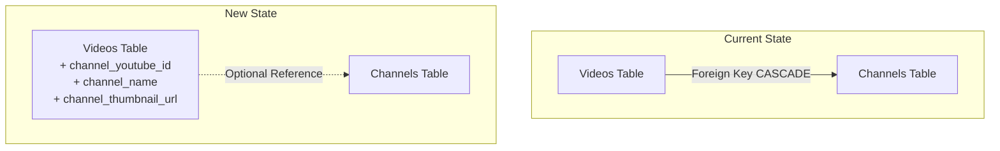

# Issue #14 - Saved Videos / Channels Separation

## Implementation Plan

**GitHub Issue:** [#14 - Saved Videos / Channels Separation](https://github.com/thejudge22/youtube-watcher/issues/14)
**Priority:** High
**Complexity:** Medium-High

---

## 1. Overview and Objectives

### Problem Statement
Currently, the Saved Videos tab is tightly coupled to the Channels tab:
- When a channel is deleted from the Channels tab, all associated videos (including saved ones) are deleted due to the `ondelete="CASCADE"` relationship
- The channel filter on the Saved Videos tab only shows channels that exist in the Channels table
- Videos added manually via URL create a channel entry in the Channels table, even if the user doesn't want to track that channel

### User Story
As a user, I want to:
1. Delete a channel from the Channels tab without losing my saved videos from that channel
2. Filter saved videos by channel, even if that channel is not being tracked on the Channels tab
3. Add videos manually without automatically adding the channel to my tracked channels list

### Success Criteria
- Deleting a channel preserves all saved videos from that channel
- The Saved Videos page channel filter shows all channels that have saved videos, regardless of whether they're tracked
- Manually adding a video does NOT add the channel to the Channels tab
- Channel information is stored with each video for filtering purposes

---

## 2. Technical Approach

### Architecture Decision: Embed Channel Info in Videos

The cleanest approach is to store channel information directly on each video record. This allows complete separation between the "tracked channels" concept and "video organization".



### Key Changes
1. **Database**: Add `channel_youtube_id`, `channel_name`, `channel_thumbnail_url` columns to videos table
2. **Database**: Change foreign key relationship from `CASCADE` to `SET NULL` on delete
3. **Backend**: Update video endpoints to use embedded channel info for display
4. **Backend**: Create new endpoint to list channels from saved videos for filtering
5. **Frontend**: Update Saved page to use new channel list endpoint for filter

---

## 3. Backend Implementation

### 3.1 Database Migration

**File:** `backend/alembic/versions/YYYYMMDD_HHMM_add_channel_info_to_videos.py`

```python
"""Add channel info to videos and change foreign key behavior

Revision ID: <auto-generated>
Revises: 63e6b77c0da0
Create Date: <auto-generated>

"""
from typing import Sequence, Union
from alembic import op
import sqlalchemy as sa


revision: str = '<auto-generated>'
down_revision: Union[str, None] = '63e6b77c0da0'
branch_labels: Union[str, Sequence[str], None] = None
depends_on: Union[str, Sequence[str], None] = None


def upgrade() -> None:
    # Step 1: Add new columns to videos table
    op.add_column('videos', sa.Column('channel_youtube_id', sa.String(), nullable=True))
    op.add_column('videos', sa.Column('channel_name', sa.String(), nullable=True))
    op.add_column('videos', sa.Column('channel_thumbnail_url', sa.String(), nullable=True))
    
    # Step 2: Create index on channel_youtube_id for efficient filtering
    op.create_index('ix_videos_channel_youtube_id', 'videos', ['channel_youtube_id'])
    
    # Step 3: Populate new columns from existing channel data
    # This uses raw SQL for efficiency
    op.execute("""
        UPDATE videos 
        SET channel_youtube_id = channels.youtube_channel_id,
            channel_name = channels.name,
            channel_thumbnail_url = channels.thumbnail_url
        FROM channels 
        WHERE videos.channel_id = channels.id
    """)
    
    # Step 4: Drop the existing foreign key constraint
    op.drop_constraint('videos_channel_id_fkey', 'videos', type_='foreignkey')
    
    # Step 5: Recreate foreign key with SET NULL on delete
    op.create_foreign_key(
        'videos_channel_id_fkey',
        'videos', 'channels',
        ['channel_id'], ['id'],
        ondelete='SET NULL'
    )


def downgrade() -> None:
    # Revert foreign key to CASCADE
    op.drop_constraint('videos_channel_id_fkey', 'videos', type_='foreignkey')
    op.create_foreign_key(
        'videos_channel_id_fkey',
        'videos', 'channels',
        ['channel_id'], ['id'],
        ondelete='CASCADE'
    )
    
    # Drop index and columns
    op.drop_index('ix_videos_channel_youtube_id', 'videos')
    op.drop_column('videos', 'channel_thumbnail_url')
    op.drop_column('videos', 'channel_name')
    op.drop_column('videos', 'channel_youtube_id')
```

### 3.2 Update Video Model

**File:** `backend/app/models/video.py`

```python
import uuid
from sqlalchemy import Column, String, DateTime, func, ForeignKey
from sqlalchemy.orm import relationship
from ..database import Base

class Video(Base):
    __tablename__ = "videos"

    id = Column(String, primary_key=True, default=lambda: str(uuid.uuid4()))
    youtube_video_id = Column(String, unique=True, nullable=False, index=True)
    
    # Foreign key to channels table (optional, SET NULL on delete)
    channel_id = Column(String, ForeignKey("channels.id", ondelete="SET NULL"), nullable=True)
    
    # Embedded channel info (denormalized for independent filtering)
    channel_youtube_id = Column(String, nullable=True, index=True)
    channel_name = Column(String, nullable=True)
    channel_thumbnail_url = Column(String, nullable=True)
    
    title = Column(String, nullable=False)
    description = Column(String)
    thumbnail_url = Column(String)
    video_url = Column(String, nullable=False)
    published_at = Column(DateTime, nullable=False)
    status = Column(String, nullable=False, default='inbox', index=True)
    saved_at = Column(DateTime, index=True)
    discarded_at = Column(DateTime, index=True)
    created_at = Column(DateTime, default=func.now())

    # Optional relationship to channel (for when channel still exists)
    channel = relationship("Channel", back_populates="videos")
```

### 3.3 Update Video Schema

**File:** `backend/app/schemas/video.py`

Add new schema for channel filter options:

```python
# Add to existing schemas

class ChannelFilterOption(BaseModel):
    """Schema for channel filter in saved videos."""
    channel_youtube_id: str
    channel_name: str
    channel_thumbnail_url: Optional[str]
    video_count: int


class VideoResponse(BaseModel):
    """Schema for video response."""
    id: str
    youtube_video_id: str
    channel_id: Optional[str]
    channel_youtube_id: Optional[str]  # Add this
    channel_name: Optional[str]
    channel_thumbnail_url: Optional[str]  # Add this
    title: str
    description: Optional[str]
    thumbnail_url: Optional[str]
    video_url: str
    published_at: datetime
    status: str
    saved_at: Optional[datetime]
    discarded_at: Optional[datetime]
```

### 3.4 Update Video Router

**File:** `backend/app/routers/videos.py`

Add new endpoint for getting channels from saved videos:

```python
@router.get("/videos/saved/channels", response_model=List[ChannelFilterOption])
async def list_saved_video_channels(db: AsyncSession = Depends(get_db)):
    """
    List all unique channels that have saved videos.
    Used for the channel filter on the Saved Videos page.
    
    Returns channels with video counts, sorted by name.
    """
    result = await db.execute(
        select(
            Video.channel_youtube_id,
            Video.channel_name,
            Video.channel_thumbnail_url,
            func.count(Video.id).label('video_count')
        )
        .where(Video.status == 'saved')
        .where(Video.channel_youtube_id.isnot(None))
        .group_by(
            Video.channel_youtube_id,
            Video.channel_name,
            Video.channel_thumbnail_url
        )
        .order_by(Video.channel_name)
    )
    
    return [
        ChannelFilterOption(
            channel_youtube_id=row.channel_youtube_id,
            channel_name=row.channel_name or "Unknown Channel",
            channel_thumbnail_url=row.channel_thumbnail_url,
            video_count=row.video_count
        )
        for row in result.all()
    ]
```

Update saved videos endpoint to filter by `channel_youtube_id`:

```python
@router.get("/videos/saved", response_model=List[VideoResponse])
async def list_saved_videos(
    channel_youtube_id: Optional[str] = Query(None, description="Filter by channel YouTube ID"),
    channel_id: Optional[str] = Query(None, description="Filter by channel ID (deprecated)"),
    sort_by: str = Query("published_at", description="Sort by 'published_at' or 'saved_at'"),
    order: str = Query("desc", description="Order 'asc' or 'desc'"),
    limit: int = Query(100, ge=1, le=500),
    offset: int = Query(0, ge=0),
    db: AsyncSession = Depends(get_db)
):
    """
    List saved videos with filtering, sorting, and pagination.
    
    The channel_youtube_id filter uses the embedded channel info, allowing
    filtering by channels even after they've been deleted from the Channels tab.
    """
    # Support both new and deprecated filter params
    filter_channel_youtube_id = channel_youtube_id
    
    # If old param is provided, look up the youtube_channel_id
    if not filter_channel_youtube_id and channel_id:
        channel_result = await db.execute(
            select(Channel.youtube_channel_id).where(Channel.id == channel_id)
        )
        channel_record = channel_result.scalar_one_or_none()
        if channel_record:
            filter_channel_youtube_id = channel_record
    
    # Use VideoService with updated filter
    videos = await VideoService.get_videos(
        db=db,
        status='saved',
        limit=limit,
        offset=offset,
        channel_youtube_id=filter_channel_youtube_id,
        sort_by=sort_by,
        order=order
    )
    
    return [map_video_to_response(video) for video in videos]
```

### 3.5 Update VideoService

**File:** `backend/app/services/video_service.py`

Update `get_videos` method to support filtering by `channel_youtube_id`:

```python
@staticmethod
async def get_videos(
    db: AsyncSession,
    status: str,
    limit: int = 100,
    offset: int = 0,
    channel_id: Optional[str] = None,
    channel_youtube_id: Optional[str] = None,  # Add this
    sort_by: str = 'published_at',
    order: str = 'desc'
) -> List[Video]:
    """
    Fetch videos with filtering and sorting.
    
    Args:
        channel_id: Filter by internal channel ID (for inbox)
        channel_youtube_id: Filter by YouTube channel ID (for saved videos)
    """
    # Validate sort parameters
    valid_sort_fields = ['published_at', 'saved_at']
    if sort_by not in valid_sort_fields:
        raise ValidationError(f"Invalid sort_by. Must be one of: {valid_sort_fields}")
    if order not in ['asc', 'desc']:
        raise ValidationError("Invalid order. Must be 'asc' or 'desc'")
    
    # Build query
    query = select(Video).options(selectinload(Video.channel))
    query = query.where(Video.status == status)
    
    # Apply channel filters
    if channel_id:
        query = query.where(Video.channel_id == channel_id)
    if channel_youtube_id:
        query = query.where(Video.channel_youtube_id == channel_youtube_id)
    
    # Apply sorting
    sort_column = getattr(Video, sort_by)
    if order == 'desc':
        query = query.order_by(sort_column.desc())
    else:
        query = query.order_by(sort_column.asc())
    
    # Apply pagination
    query = query.limit(limit).offset(offset)
    
    result = await db.execute(query)
    return result.scalars().all()
```

### 3.6 Update add_video_from_url Endpoint

**File:** `backend/app/routers/videos.py`

Modify the `add_video_from_url` endpoint to NOT create a channel:

```python
@router.post("/videos/from-url", response_model=VideoResponse)
async def add_video_from_url(video_data: VideoFromUrl, db: AsyncSession = Depends(get_db)):
    """
    Add a video from a YouTube URL.
    
    Logic:
    1. Extract video ID from URL
    2. Check if video already exists (update to saved if so)
    3. Fetch video info from yt-dlp
    4. Create video with channel info embedded (does NOT create channel record)
    5. If video's channel exists in channels table, link it
    """
    # Step 1: Extract video ID
    try:
        youtube_video_id = extract_video_id(video_data.url)
    except ValueError as e:
        raise ValidationError(str(e), field="url")
    
    # Step 2: Check if video already exists
    existing = await db.execute(
        select(Video)
        .options(selectinload(Video.channel))
        .where(Video.youtube_video_id == youtube_video_id)
    )
    existing_video = existing.scalar_one_or_none()
    
    if existing_video:
        existing_video.status = 'saved'
        existing_video.saved_at = datetime.now(timezone.utc)
        existing_video.discarded_at = None
        
        await db.commit()
        await db.refresh(existing_video)
        
        response_data = map_video_to_response(existing_video)
        return JSONResponse(
            status_code=status.HTTP_200_OK,
            content=response_data.model_dump(mode='json')
        )
    
    # Step 3: Fetch video info
    timeout = await get_http_timeout(db)
    try:
        video_info = await fetch_video_by_id(youtube_video_id, timeout=timeout)
    except Exception as e:
        raise ExternalServiceError("YouTube", "fetch video info", str(e))
    
    # Step 4: Check if channel exists in channels table (don't create if not)
    channel_id = None
    if video_info.channel_id:
        channel_result = await db.execute(
            select(Channel).where(Channel.youtube_channel_id == video_info.channel_id)
        )
        channel = channel_result.scalar_one_or_none()
        if channel:
            channel_id = channel.id
    
    # Step 5: Create video with embedded channel info
    now = datetime.now(timezone.utc)
    video = Video(
        youtube_video_id=video_info.video_id,
        channel_id=channel_id,  # May be None if channel not tracked
        channel_youtube_id=video_info.channel_id,
        channel_name=video_info.channel_name,
        channel_thumbnail_url=None,  # Can fetch separately if needed
        title=video_info.title,
        description=video_info.description,
        thumbnail_url=video_info.thumbnail_url,
        video_url=video_info.video_url,
        published_at=video_info.published_at,
        status='saved',
        saved_at=now
    )
    db.add(video)
    await db.commit()
    await db.refresh(video)
    
    # Load channel for response if it exists
    if channel_id:
        await db.refresh(video, ['channel'])
    
    response_data = map_video_to_response(video)
    return JSONResponse(
        status_code=status.HTTP_201_CREATED,
        content=response_data.model_dump(mode='json')
    )
```

### 3.7 Update Mapper

**File:** `backend/app/schemas/mappers.py`

Update mapper to include new channel fields:

```python
def map_video_to_response(video: Video) -> VideoResponse:
    """Map a Video model to VideoResponse schema."""
    # Use embedded channel info, fall back to relationship if available
    channel_name = video.channel_name
    if not channel_name and video.channel:
        channel_name = video.channel.name
    
    channel_thumbnail = video.channel_thumbnail_url
    if not channel_thumbnail and video.channel:
        channel_thumbnail = video.channel.thumbnail_url
    
    return VideoResponse(
        id=video.id,
        youtube_video_id=video.youtube_video_id,
        channel_id=video.channel_id,
        channel_youtube_id=video.channel_youtube_id,
        channel_name=channel_name,
        channel_thumbnail_url=channel_thumbnail,
        title=video.title,
        description=video.description,
        thumbnail_url=video.thumbnail_url,
        video_url=video.video_url,
        published_at=video.published_at,
        status=video.status,
        saved_at=video.saved_at,
        discarded_at=video.discarded_at
    )
```

### 3.8 Update Channel Creation to Populate Video Channel Info

**File:** `backend/app/routers/channels.py`

When creating a channel, populate the embedded channel info on new videos:

```python
# In the create_channel endpoint, after creating videos:
for video_info in videos_info:
    video = Video(
        youtube_video_id=video_info.video_id,
        channel_id=channel.id,
        channel_youtube_id=channel.youtube_channel_id,  # Add this
        channel_name=channel.name,  # Add this
        channel_thumbnail_url=channel.thumbnail_url,  # Add this
        title=video_info.title,
        # ... rest of fields
    )
    db.add(video)
```

Similarly update `_process_new_videos` in the same file.

---

## 4. Frontend Implementation

### 4.1 Update TypeScript Types

**File:** `frontend/src/types/index.ts`

```typescript
export interface Video {
  id: string;
  youtube_video_id: string;
  channel_id: string | null;
  channel_youtube_id: string | null;  // Add this
  channel_name: string | null;
  channel_thumbnail_url: string | null;  // Add this
  title: string;
  description: string | null;
  thumbnail_url: string | null;
  video_url: string;
  published_at: string;
  status: 'inbox' | 'saved' | 'discarded';
  saved_at: string | null;
  created_at: string;
}

// Add new interface for channel filter options
export interface ChannelFilterOption {
  channel_youtube_id: string;
  channel_name: string;
  channel_thumbnail_url: string | null;
  video_count: number;
}

export interface SavedVideosParams {
  channel_youtube_id?: string;  // Change from channel_id
  sort_by?: 'published_at' | 'saved_at';
  order?: 'asc' | 'desc';
}
```

### 4.2 Update API Client

**File:** `frontend/src/api/client.ts`

```typescript
import type { ChannelFilterOption } from '../types';

// Add to videosApi object:
export const videosApi = {
  // ... existing methods
  
  getSaved: (params?: SavedVideosParams) => api.get<Video[]>('/videos/saved', { params }),
  
  // Add new method for getting channel filter options
  getSavedChannels: () => api.get<ChannelFilterOption[]>('/videos/saved/channels'),
};
```

### 4.3 Add Hook for Saved Video Channels

**File:** `frontend/src/hooks/useVideos.ts`

```typescript
// Add new hook for channel filter options
export function useSavedVideoChannels() {
  return useQuery({
    queryKey: ['videos', 'saved', 'channels'],
    queryFn: async () => {
      const { data } = await videosApi.getSavedChannels();
      return data;
    },
  });
}
```

### 4.4 Update Saved Page

**File:** `frontend/src/pages/Saved.tsx`

```typescript
import { useSavedVideos, useSavedVideoChannels, useDiscardVideo, useBulkDiscardVideos } from '../hooks/useVideos';
// Remove: import { useChannels } from '../hooks/useChannels';
import type { SavedVideosParams, ChannelFilterOption } from '../types';

// ... inside component:

export function Saved() {
  const [channelYoutubeId, setChannelYoutubeId] = useState<string>('');
  // ... other state
  
  const params: SavedVideosParams = useMemo(() => {
    const p: SavedVideosParams = {};
    if (channelYoutubeId) {
      p.channel_youtube_id = channelYoutubeId;  // Changed from channel_id
    }
    if (sortBy) {
      p.sort_by = sortBy;
    }
    if (order) {
      p.order = order;
    }
    return p;
  }, [channelYoutubeId, sortBy, order]);

  const { data: videos, isLoading, error, refetch } = useSavedVideos(params);
  const { data: channelOptions } = useSavedVideoChannels();  // Use new hook
  
  // ... rest of component
  
  // Update the channel filter dropdown:
  <select
    id="channel-filter"
    value={channelYoutubeId}
    onChange={(e) => setChannelYoutubeId(e.target.value)}
    className="..."
  >
    <option value="">All Channels</option>
    {channelOptions?.map((option) => (
      <option key={option.channel_youtube_id} value={option.channel_youtube_id}>
        {option.channel_name} ({option.video_count})
      </option>
    ))}
  </select>
}
```

---

## 5. Testing Strategy

### 5.1 Backend Tests

**File:** `backend/tests/test_api_videos.py`

Add tests for:

```python
# Test channel info is preserved after channel deletion
async def test_saved_video_preserved_after_channel_deletion():
    """Verify saved videos remain after their channel is deleted."""
    # 1. Create channel with videos
    # 2. Save a video
    # 3. Delete the channel
    # 4. Verify video still exists with channel_youtube_id and channel_name

async def test_list_saved_video_channels():
    """Test the endpoint that lists channels from saved videos."""
    # 1. Create videos from different channels
    # 2. Call GET /videos/saved/channels
    # 3. Verify correct channels and counts returned

async def test_add_video_from_url_no_channel_created():
    """Verify adding video from URL doesn't create channel entry."""
    # 1. Add video from URL
    # 2. Verify video exists with channel info
    # 3. Verify channel table does NOT contain the video's channel

async def test_filter_saved_by_channel_youtube_id():
    """Test filtering saved videos by channel_youtube_id."""
    # 1. Create videos from multiple channels
    # 2. Filter by specific channel_youtube_id
    # 3. Verify only matching videos returned
```

### 5.2 Migration Test

Verify the data migration:

```python
async def test_migration_populates_channel_info():
    """Verify migration correctly populates new channel columns."""
    # This should be run after migration on a database with existing data
    # Verify all videos with channel_id have populated channel_youtube_id, channel_name
```

---

## 6. Edge Cases and Considerations

### 6.1 Backward Compatibility
- The `channel_id` query parameter for saved videos should continue to work (deprecated but functional)
- Existing videos need channel info populated via migration

### 6.2 Data Consistency
- When a tracked channel is updated (renamed), the embedded channel_name in videos remains unchanged
- This is intentional - it preserves the channel name at the time the video was saved
- If needed, a "sync channel info" feature could be added later

### 6.3 Channel Thumbnail for Manual Videos
- When adding videos manually, we may not have the channel thumbnail
- This is acceptable - the filter will still work, just without the thumbnail

### 6.4 Storage Considerations
- Adding three new columns per video increases storage slightly
- Trade-off for better user experience and data independence

---

## 7. Implementation Checklist

### Backend
- [ ] Create and test database migration
- [ ] Update Video model with new columns
- [ ] Update VideoResponse schema with new fields
- [ ] Add ChannelFilterOption schema
- [ ] Update VideoService.get_videos for channel_youtube_id filter
- [ ] Add GET /videos/saved/channels endpoint
- [ ] Update GET /videos/saved to use channel_youtube_id
- [ ] Update POST /videos/from-url to not create channels
- [ ] Update map_video_to_response mapper
- [ ] Update channel creation to populate video channel info
- [ ] Update channel refresh to populate video channel info
- [ ] Write comprehensive tests

### Frontend
- [ ] Update Video type with new fields
- [ ] Add ChannelFilterOption type
- [ ] Update SavedVideosParams type
- [ ] Add getSavedChannels API method
- [ ] Add useSavedVideoChannels hook
- [ ] Update Saved page to use new channel filter
- [ ] Test the complete flow

### Documentation
- [ ] Update API documentation
- [ ] Update README if needed
