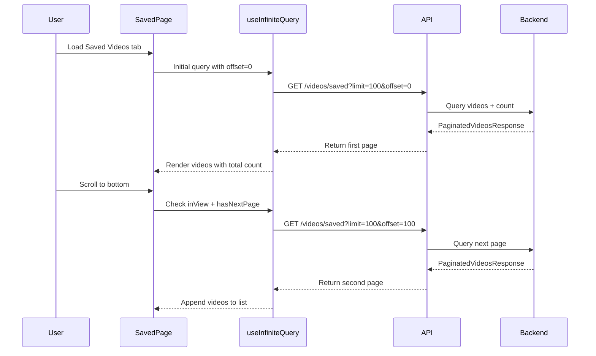

# Issue #32: Saved Videos Pagination Implementation Plan

## Issue Summary

**Title:** Saved Videos only show 100 videos at a time  
**Problem:** The Saved Videos tab shows only 100 videos at a time with no pagination available. Users with more than 100 saved videos cannot access all their videos.

## Root Cause Analysis

### Current Implementation

1. **Backend API** ([`backend/app/routers/videos.py:83-147`](backend/app/routers/videos.py:83))
   - The `/videos/saved` endpoint already supports pagination with `limit` and `offset` parameters
   - Default limit is 100 (max 500)
   - Returns a `List[VideoResponse]` without total count

2. **Frontend API Client** ([`frontend/src/api/client.ts:93`](frontend/src/api/client.ts:93))
   - `getSaved` method passes `params` to the API but frontend never includes `limit` or `offset`

3. **Frontend Hook** ([`frontend/src/hooks/useVideos.ts:18-26`](frontend/src/hooks/useVideos.ts:18))
   - `useSavedVideos` hook doesn't handle pagination state

4. **Saved Page** ([`frontend/src/pages/Saved.tsx`](frontend/src/pages/Saved.tsx))
   - No pagination UI or state management
   - Displays count as `{videos.length} video(s) saved` which only shows fetched count

### Key Issue
The frontend never requests more than the default 100 videos and has no mechanism to paginate through results.

---

## Implementation Plan

### Option 1: Load All Videos (Recommended for user sets under 1000)
Remove the limit entirely or set it very high to load all videos at once.

**Pros:** Simple implementation, no UI changes needed  
**Cons:** May cause performance issues with very large collections

### Option 2: Infinite Scroll Pagination (Recommended)
Load videos incrementally as the user scrolls down.

**Pros:** Good UX, loads data on demand  
**Cons:** More complex implementation

### Option 3: Classic Pagination with Page Numbers
Add traditional pagination controls with page numbers.

**Pros:** Familiar UX, predictable loading  
**Cons:** More clicks required to navigate

---

## Recommended Approach: Infinite Scroll Pagination

This approach provides the best user experience while managing memory and request sizes.

---

## Detailed Implementation Tasks

### Task 1: Update Backend to Return Total Count

**File:** [`backend/app/routers/videos.py`](backend/app/routers/videos.py)

**Changes:**

1. Create a new Pydantic schema for paginated response:

```python
# In backend/app/schemas/video.py
class PaginatedVideosResponse(BaseModel):
    videos: List[VideoResponse]
    total: int
    limit: int
    offset: int
    has_more: bool
```

2. Update `/videos/saved` endpoint to return paginated response:

```python
@router.get("/videos/saved", response_model=PaginatedVideosResponse)
async def list_saved_videos(
    channel_youtube_id: Optional[str] = Query(None, description="Filter by channel YouTube ID"),
    channel_id: Optional[str] = Query(None, description="Filter by channel ID (deprecated)"),
    sort_by: str = Query("published_at", description="Sort by 'published_at' or 'saved_at'"),
    order: str = Query("desc", description="Order 'asc' or 'desc'"),
    limit: int = Query(100, ge=1, le=500, description="Maximum number of videos to return"),
    offset: int = Query(0, ge=0, description="Number of videos to skip"),
    db: AsyncSession = Depends(get_db)
):
```

3. Add a count query to get total saved videos:

```python
# Get total count for pagination
count_query = select(func.count(Video.id)).where(Video.status == 'saved')
if filter_channel_youtube_id:
    count_query = count_query.where(Video.channel_youtube_id == filter_channel_youtube_id)
count_result = await db.execute(count_query)
total = count_result.scalar_one()
```

4. Return paginated response:

```python
return PaginatedVideosResponse(
    videos=[...video responses...],
    total=total,
    limit=limit,
    offset=offset,
    has_more=(offset + len(videos)) < total
)
```

---

### Task 2: Update Backend Schema

**File:** [`backend/app/schemas/video.py`](backend/app/schemas/video.py)

Add the new schema class:

```python
class PaginatedVideosResponse(BaseModel):
    """Response schema for paginated video lists."""
    videos: List[VideoResponse]
    total: int
    limit: int
    offset: int
    has_more: bool

    model_config = ConfigDict(from_attributes=True)
```

---

### Task 3: Update Frontend Types

**File:** [`frontend/src/types/index.ts`](frontend/src/types/index.ts)

Add pagination-related types:

```typescript
export interface PaginatedVideosResponse {
  videos: Video[];
  total: number;
  limit: number;
  offset: number;
  has_more: boolean;
}

export interface SavedVideosParams {
  channel_youtube_id?: string;
  sort_by?: 'published_at' | 'saved_at';
  order?: 'asc' | 'desc';
  limit?: number;
  offset?: number;
}
```

---

### Task 4: Update Frontend API Client

**File:** [`frontend/src/api/client.ts`](frontend/src/api/client.ts)

Update the `getSaved` method return type:

```typescript
import type { Channel, Video, SavedVideosParams, ChannelFilterOption, PaginatedVideosResponse } from '../types';

// In videosApi object:
getSaved: (params?: SavedVideosParams) => 
  api.get<PaginatedVideosResponse>('/videos/saved', { params }),
```

---

### Task 5: Update Frontend Hook with Infinite Query

**File:** [`frontend/src/hooks/useVideos.ts`](frontend/src/hooks/useVideos.ts)

Replace the `useSavedVideos` hook with an infinite query version:

```typescript
import { useMutation, useQuery, useQueryClient, useInfiniteQuery } from '@tanstack/react-query';

const PAGE_SIZE = 100;

export function useSavedVideos(params?: Omit<SavedVideosParams, 'limit' | 'offset'>) {
  return useInfiniteQuery({
    queryKey: ['videos', 'saved', params],
    queryFn: async ({ pageParam = 0 }) => {
      const { data } = await videosApi.getSaved({
        ...params,
        limit: PAGE_SIZE,
        offset: pageParam,
      });
      return data;
    },
    getNextPageParam: (lastPage) => {
      if (!lastPage.has_more) return undefined;
      return lastPage.offset + lastPage.limit;
    },
    initialPageParam: 0,
  });
}
```

---

### Task 6: Update Saved Page Component

**File:** [`frontend/src/pages/Saved.tsx`](frontend/src/pages/Saved.tsx)

**Changes Required:**

1. Import `useInView` from `react-intersection-observer` for infinite scroll detection:

```typescript
import { useInView } from 'react-intersection-observer';
```

2. Update the hook usage to handle paginated data:

```typescript
const {
  data,
  isLoading,
  error,
  refetch,
  fetchNextPage,
  hasNextPage,
  isFetchingNextPage,
} = useSavedVideos(params);

// Flatten paginated data
const videos = useMemo(() => {
  if (!data?.pages) return [];
  return data.pages.flatMap(page => page.videos);
}, [data]);

// Get total count from first page
const totalCount = data?.pages[0]?.total ?? 0;
```

3. Add intersection observer for infinite scroll:

```typescript
const { ref: loadMoreRef, inView } = useInView({
  threshold: 0,
});

// Load more when scrolling to bottom
useEffect(() => {
  if (inView && hasNextPage && !isFetchingNextPage) {
    fetchNextPage();
  }
}, [inView, hasNextPage, isFetchingNextPage, fetchNextPage]);
```

4. Update the video count display:

```typescript
<p className="text-gray-400 text-sm mt-1">
  {videos.length} of {totalCount} video{totalCount !== 1 ? 's' : ''} saved
</p>
```

5. Add load more trigger at the bottom of the list:

```typescript
{/* Load more trigger */}
<div ref={loadMoreRef} className="py-4 flex justify-center">
  {isFetchingNextPage && <LoadingSpinner size="md" />}
  {!hasNextPage && videos.length > 0 && (
    <p className="text-gray-500 text-sm">All videos loaded</p>
  )}
</div>
```

6. Update `handleSelectAll` to only select visible videos or add a note:

```typescript
const handleSelectAll = () => {
  setSelectedIds(new Set(videos.map(v => v.id)));
};
// Note: This selects only currently loaded videos
```

---

### Task 7: Add react-intersection-observer Dependency

**File:** [`frontend/package.json`](frontend/package.json)

Add the dependency:

```bash
npm install react-intersection-observer
```

---

### Task 8: Update Query Invalidation

**File:** [`frontend/src/hooks/useVideos.ts`](frontend/src/hooks/useVideos.ts)

Ensure all mutations that affect saved videos properly invalidate the infinite query. The existing `queryKey: ['videos', 'saved']` invalidation should work, but verify it triggers refetch of all pages.

---

## Testing Checklist

- [ ] Backend returns correct `total` count with filters applied
- [ ] Backend returns correct `has_more` value
- [ ] Frontend displays correct total count regardless of loaded videos
- [ ] Infinite scroll loads next page when scrolling to bottom
- [ ] Channel filter works correctly with pagination (resets to first page)
- [ ] Sort filter works correctly with pagination (resets to first page)
- [ ] Select All selects only visible/loaded videos with appropriate UI indication
- [ ] Play as Playlist works with selected videos
- [ ] Loading states display correctly during initial load and page fetches
- [ ] Error handling works for failed page fetches
- [ ] Performance is acceptable with large video collections (500+ videos)

---

## File Changes Summary

| File | Change Type | Description |
|------|-------------|-------------|
| `backend/app/schemas/video.py` | ADD | Add `PaginatedVideosResponse` schema |
| `backend/app/routers/videos.py` | MODIFY | Update `/videos/saved` endpoint to return paginated response with total count |
| `frontend/src/types/index.ts` | MODIFY | Add `PaginatedVideosResponse` interface, update `SavedVideosParams` |
| `frontend/src/api/client.ts` | MODIFY | Update `getSaved` return type |
| `frontend/src/hooks/useVideos.ts` | MODIFY | Convert `useSavedVideos` to use `useInfiniteQuery` |
| `frontend/src/pages/Saved.tsx` | MODIFY | Implement infinite scroll UI with intersection observer |
| `frontend/package.json` | MODIFY | Add `react-intersection-observer` dependency |

---

## Architecture Diagram



---

## Notes for Implementer

1. **Backward Compatibility:** The backend change should be backward compatible - existing clients that don't use the new fields will still work.

2. **Query Key Strategy:** When filters change (channel, sort), the infinite query should reset. React Query handles this automatically when the queryKey changes.

3. **Memory Management:** With infinite scroll, all loaded videos remain in memory. For very large collections (1000+), consider implementing virtualization with `react-virtual` or `react-window`.

4. **Select All Behavior:** Consider adding a "Select All X Videos" option that makes additional API calls to get all video IDs, or clearly indicate that "Select All" only selects currently loaded videos.

5. **Mutation Handling:** When a video is discarded from the saved list, the total count should decrease. Ensure mutations trigger a refetch of the first page to get updated totals.
