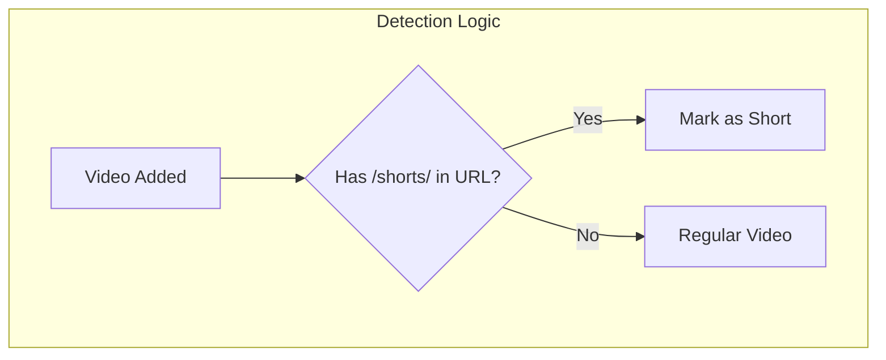

# Issue #8 - YouTube Shorts Separation

## Implementation Plan

**GitHub Issue:** [#8 - Youtube Shorts Separation](https://github.com/thejudge22/youtube-watcher/issues/8)
**Priority:** Medium
**Complexity:** Low-Medium

---

## 1. Overview and Objectives

### Problem Statement
YouTube Shorts are short-form vertical videos that have become increasingly common on YouTube. Currently, the application does not distinguish between regular videos and Shorts, making it harder for users to manage their inbox effectively.

### User Story
As a user, I want to:
1. Clearly see which videos in my inbox are YouTube Shorts
2. Filter the inbox to show only Shorts or only regular videos
3. Quickly identify Shorts through visual indicators

### Success Criteria
- Shorts are automatically detected when videos are added
- Visual indicator (badge/icon) shows which videos are Shorts
- Filter option allows viewing only Shorts or only regular videos
- Detection works for both new videos from channel refresh and manually added videos

---

## 2. Technical Approach

### How to Detect YouTube Shorts

YouTube Shorts can be identified through the **URL pattern**. Shorts have URLs like `https://www.youtube.com/shorts/VIDEO_ID`.

**Note:** While Shorts were originally limited to 60 seconds, YouTube now allows Shorts of varying lengths. The `/shorts/` URL pattern is the most reliable detection method since all Shorts use this URL format regardless of duration.



### Architecture Changes

1. **Database**: Add `is_short` boolean column to videos table
2. **Backend**: Detect Shorts during video creation/import
3. **Backend**: Add filter parameter to inbox endpoint
4. **Frontend**: Add visual indicator for Shorts
5. **Frontend**: Add filter toggle in Inbox

---

## 3. Backend Implementation

### 3.1 Database Migration

**File:** `backend/alembic/versions/YYYYMMDD_HHMM_add_is_short_to_videos.py`

```python
"""Add is_short column to videos table

Revision ID: <auto-generated>
Revises: <previous-revision>
Create Date: <auto-generated>

"""
from typing import Sequence, Union
from alembic import op
import sqlalchemy as sa


revision: str = '<auto-generated>'
down_revision: Union[str, None] = '<previous-revision>'
branch_labels: Union[str, Sequence[str], None] = None
depends_on: Union[str, Sequence[str], None] = None


def upgrade() -> None:
    # Add is_short column with default False
    op.add_column('videos', sa.Column('is_short', sa.Boolean(), server_default='false', nullable=False))
    
    # Create index for efficient filtering
    op.create_index('ix_videos_is_short', 'videos', ['is_short'])


def downgrade() -> None:
    op.drop_index('ix_videos_is_short', table_name='videos')
    op.drop_column('videos', 'is_short')
```

### 3.2 Update Video Model

**File:** `backend/app/models/video.py`

```python
import uuid
from sqlalchemy import Column, String, DateTime, Boolean, func, ForeignKey
from sqlalchemy.orm import relationship
from ..database import Base

class Video(Base):
    __tablename__ = "videos"

    id = Column(String, primary_key=True, default=lambda: str(uuid.uuid4()))
    youtube_video_id = Column(String, unique=True, nullable=False, index=True)
    channel_id = Column(String, ForeignKey("channels.id", ondelete="SET NULL"), nullable=True)
    
    # Add these columns for Issue #14 if implementing together
    # channel_youtube_id = Column(String, nullable=True, index=True)
    # channel_name = Column(String, nullable=True)
    # channel_thumbnail_url = Column(String, nullable=True)
    
    title = Column(String, nullable=False)
    description = Column(String)
    thumbnail_url = Column(String)
    video_url = Column(String, nullable=False)
    published_at = Column(DateTime, nullable=False)
    status = Column(String, nullable=False, default='inbox', index=True)
    saved_at = Column(DateTime, index=True)
    discarded_at = Column(DateTime, index=True)
    created_at = Column(DateTime, default=func.now())
    
    # New field for Shorts detection
    is_short = Column(Boolean, default=False, nullable=False, index=True)

    channel = relationship("Channel", back_populates="videos")
```

### 3.3 Update VideoInfo Model in RSS Parser

**File:** `backend/app/services/rss_parser.py`

Update the `VideoInfo` model to include Shorts status:

```python
class VideoInfo(BaseModel):
    """Information about a YouTube video."""
    video_id: str
    channel_id: str
    channel_name: str
    title: str
    description: Optional[str] = None
    thumbnail_url: Optional[str] = None
    video_url: str
    published_at: datetime
    is_short: bool = False  # Add this field
```

### 3.4 Create Shorts Detection Service

**File:** `backend/app/services/shorts_detector.py`

```python
"""
Service for detecting YouTube Shorts based on URL pattern.

YouTube Shorts are identified by the /shorts/ URL pattern. This is the most
reliable detection method since all Shorts use this URL format regardless
of their duration (YouTube now allows Shorts of varying lengths).
"""

import re
import logging

logger = logging.getLogger(__name__)

# Shorts URL pattern
SHORTS_URL_PATTERN = re.compile(r'youtube\.com/shorts/')


def is_shorts_url(url: str) -> bool:
    """
    Check if a URL is a Shorts URL.
    
    Args:
        url: YouTube video URL
        
    Returns:
        True if URL contains /shorts/ pattern
    """
    return bool(SHORTS_URL_PATTERN.search(url))


def get_shorts_url(video_id: str) -> str:
    """Get the Shorts URL for a video ID."""
    return f"https://www.youtube.com/shorts/{video_id}"


def get_regular_url(video_id: str) -> str:
    """Get the regular watch URL for a video ID."""
    return f"https://www.youtube.com/watch?v={video_id}"


def is_short_from_video_info(video_info: dict) -> bool:
    """
    Determine if a video is a Short from yt-dlp video info dict.
    
    Checks for /shorts/ in URL fields returned by yt-dlp.
    
    Args:
        video_info: Dictionary from yt-dlp extract_info
        
    Returns:
        True if video appears to be a Short
    """
    # Check webpage_url for /shorts/
    webpage_url = video_info.get('webpage_url', '')
    if is_shorts_url(webpage_url):
        return True
    
    # Check original_url
    original_url = video_info.get('original_url', '')
    if is_shorts_url(original_url):
        return True
    
    return False
```

### 3.5 Update fetch_video_by_id

**File:** `backend/app/services/rss_parser.py`

Update to include Shorts detection based on URL:

```python
from .shorts_detector import is_short_from_video_info

@retry(
    stop=stop_after_attempt(3),
    wait=wait_exponential(multiplier=1, min=1, max=10),
    retry=retry_if_exception_type((yt_dlp.utils.DownloadError,)),
)
async def fetch_video_by_id(video_id: str, timeout: float = 10.0) -> VideoInfo:
    """
    Fetch video information using yt-dlp.
    
    Includes Shorts detection based on URL pattern.
    """
    video_url = get_video_url(video_id)
    
    try:
        ydl_opts = {
            'quiet': True,
            'no_warnings': True,
            'skip_download': True,
            'extract_flat': False,
        }
        
        with yt_dlp.YoutubeDL(ydl_opts) as ydl:
            info = ydl.extract_info(video_url, download=False)
        
        title = info.get('title', '')
        channel_name = info.get('uploader', '')
        channel_id = info.get('channel_id', '')
        description = info.get('description', None)
        thumbnail_url = info.get('thumbnail', f"https://i.ytimg.com/vi/{video_id}/hqdefault.jpg")
        
        # Detect if this is a Short based on URL
        is_short = is_short_from_video_info(info)
        
        # Parse upload_date
        upload_date_str = info.get('upload_date')
        if upload_date_str:
            published_at = datetime.strptime(upload_date_str, '%Y%m%d').replace(tzinfo=timezone.utc)
        else:
            published_at = datetime.now(timezone.utc)
        
        return VideoInfo(
            video_id=video_id,
            channel_id=channel_id,
            channel_name=channel_name,
            title=title,
            description=description,
            thumbnail_url=thumbnail_url,
            video_url=video_url,
            published_at=published_at,
            is_short=is_short
        )
    except yt_dlp.utils.DownloadError as e:
        raise ValueError(f"Failed to fetch video info for {video_id}: {str(e)}")
```

### 3.6 Update fetch_videos for RSS Feeds

The RSS feed doesn't include Shorts URL information (videos are listed with regular watch URLs). We use the following approach:

**Detect Shorts Later (Recommended)**
- Mark videos as `is_short=False` initially from RSS
- Add a "Detect Shorts" button for on-demand detection to update Shorts status
- This avoids slowing down channel refresh significantly
- Detection uses yt-dlp to fetch video info and check if URL redirects to /shorts/

For this approach, update the channel refresh logic:

**File:** `backend/app/routers/channels.py`

```python
# In the video creation during channel add/refresh:
video = Video(
    youtube_video_id=video_info.video_id,
    channel_id=channel.id,
    title=video_info.title,
    # ... other fields
    is_short=False  # Default to False, can be detected later via "Detect Shorts" button
)
```

### 3.7 Add Shorts Detection Endpoint

**File:** `backend/app/routers/videos.py`

Add an endpoint to detect and update Shorts status by fetching video info and checking URL:

```python
from ..services.shorts_detector import is_short_from_video_info
from ..services.rss_parser import fetch_video_by_id

@router.post("/videos/{video_id}/detect-short", response_model=VideoResponse)
async def detect_video_short(
    video_id: str = Path(..., pattern="^[a-f0-9]{8}-[a-f0-9]{4}-[a-f0-9]{4}-[a-f0-9]{4}-[a-f0-9]{12}$"),
    db: AsyncSession = Depends(get_db)
):
    """
    Detect if a video is a YouTube Short and update its status.
    
    Fetches video info via yt-dlp and checks if URL contains /shorts/.
    """
    # Get video
    result = await db.execute(
        select(Video)
        .options(selectinload(Video.channel))
        .where(Video.id == video_id)
    )
    video = result.scalar_one_or_none()
    
    if not video:
        raise NotFoundError("Video", video_id)
    
    # Fetch video info and detect if it's a Short via URL
    video_info = await fetch_video_by_id(video.youtube_video_id)
    video.is_short = video_info.is_short
    
    await db.commit()
    await db.refresh(video)
    
    return map_video_to_response(video)


@router.post("/videos/detect-shorts-batch")
async def detect_shorts_batch(
    video_ids: List[str] = None,
    db: AsyncSession = Depends(get_db)
):
    """
    Detect Shorts status for multiple videos or all inbox videos.
    
    If video_ids is not provided, detects for all inbox videos.
    Uses URL-based detection via yt-dlp.
    """
    if video_ids:
        result = await db.execute(
            select(Video).where(Video.id.in_(video_ids))
        )
    else:
        # Detect for all inbox videos that haven't been checked
        result = await db.execute(
            select(Video).where(Video.status == 'inbox')
        )
    
    videos = result.scalars().all()
    updated_count = 0
    
    for video in videos:
        try:
            video_info = await fetch_video_by_id(video.youtube_video_id)
            if video.is_short != video_info.is_short:
                video.is_short = video_info.is_short
                updated_count += 1
        except Exception as e:
            logger.warning(f"Could not detect Short status for {video.youtube_video_id}: {e}")
    
    await db.commit()
    
    return {
        "total_checked": len(videos),
        "updated_count": updated_count
    }
```

### 3.8 Update Video Schema

**File:** `backend/app/schemas/video.py`

```python
class VideoResponse(BaseModel):
    """Schema for video response."""
    id: str
    youtube_video_id: str
    channel_id: Optional[str]
    channel_name: Optional[str]
    title: str
    description: Optional[str]
    thumbnail_url: Optional[str]
    video_url: str
    published_at: datetime
    status: str
    saved_at: Optional[datetime]
    discarded_at: Optional[datetime]
    is_short: bool = False  # Add this field
```

### 3.9 Update Video Mapper

**File:** `backend/app/schemas/mappers.py`

```python
def map_video_to_response(video: Video) -> VideoResponse:
    """Map a Video model to VideoResponse schema."""
    return VideoResponse(
        id=video.id,
        youtube_video_id=video.youtube_video_id,
        channel_id=video.channel_id,
        channel_name=video.channel.name if video.channel else None,
        title=video.title,
        description=video.description,
        thumbnail_url=video.thumbnail_url,
        video_url=video.video_url,
        published_at=video.published_at,
        status=video.status,
        saved_at=video.saved_at,
        discarded_at=video.discarded_at,
        is_short=video.is_short  # Add this
    )
```

### 3.10 Update Inbox Endpoint with Filter

**File:** `backend/app/routers/videos.py`

```python
@router.get("/videos/inbox", response_model=List[VideoResponse])
async def list_inbox_videos(
    limit: int = Query(100, ge=1, le=500),
    offset: int = Query(0, ge=0),
    channel_id: Optional[str] = Query(None, description="Filter by channel ID"),
    is_short: Optional[bool] = Query(None, description="Filter by Shorts status"),
    db: AsyncSession = Depends(get_db)
):
    """
    List all videos with status='inbox' with pagination.
    
    Query params:
        limit: Maximum number of videos to return
        offset: Number of videos to skip
        channel_id: Filter by channel (optional)
        is_short: Filter by Shorts status (optional, None=all, True=shorts only, False=regular only)
    """
    videos = await VideoService.get_videos(
        db=db,
        status='inbox',
        limit=limit,
        offset=offset,
        channel_id=channel_id,
        is_short=is_short,
        sort_by='published_at',
        order='desc'
    )

    return [map_video_to_response(video) for video in videos]
```

### 3.11 Update VideoService

**File:** `backend/app/services/video_service.py`

```python
@staticmethod
async def get_videos(
    db: AsyncSession,
    status: str,
    limit: int = 100,
    offset: int = 0,
    channel_id: Optional[str] = None,
    channel_youtube_id: Optional[str] = None,
    is_short: Optional[bool] = None,  # Add this parameter
    sort_by: str = 'published_at',
    order: str = 'desc'
) -> List[Video]:
    """Fetch videos with filtering and sorting."""
    # Validate sort parameters
    valid_sort_fields = ['published_at', 'saved_at']
    if sort_by not in valid_sort_fields:
        raise ValidationError(f"Invalid sort_by. Must be one of: {valid_sort_fields}")
    if order not in ['asc', 'desc']:
        raise ValidationError("Invalid order. Must be 'asc' or 'desc'")
    
    # Build query
    query = select(Video).options(selectinload(Video.channel))
    query = query.where(Video.status == status)
    
    # Apply filters
    if channel_id:
        query = query.where(Video.channel_id == channel_id)
    if channel_youtube_id:
        query = query.where(Video.channel_youtube_id == channel_youtube_id)
    if is_short is not None:  # Add this filter
        query = query.where(Video.is_short == is_short)
    
    # Apply sorting
    sort_column = getattr(Video, sort_by)
    if order == 'desc':
        query = query.order_by(sort_column.desc())
    else:
        query = query.order_by(sort_column.asc())
    
    # Apply pagination
    query = query.limit(limit).offset(offset)
    
    result = await db.execute(query)
    return result.scalars().all()
```

### 3.12 Update add_video_from_url to Detect Shorts

**File:** `backend/app/routers/videos.py`

```python
@router.post("/videos/from-url", response_model=VideoResponse)
async def add_video_from_url(video_data: VideoFromUrl, db: AsyncSession = Depends(get_db)):
    """Add a video from a YouTube URL."""
    # ... existing code ...
    
    # When creating the video, use the is_short from video_info
    video = Video(
        youtube_video_id=video_info.video_id,
        # ... other fields ...
        is_short=video_info.is_short  # Add this
    )
    
    # ... rest of endpoint
```

---

## 4. Frontend Implementation

### 4.1 Update TypeScript Types

**File:** `frontend/src/types/index.ts`

```typescript
export interface Video {
  id: string;
  youtube_video_id: string;
  channel_id: string | null;
  channel_name: string | null;
  title: string;
  description: string | null;
  thumbnail_url: string | null;
  video_url: string;
  published_at: string;
  status: 'inbox' | 'saved' | 'discarded';
  saved_at: string | null;
  created_at: string;
  is_short: boolean;  // Add this field
}

// Add filter type
export type ShortsFilter = 'all' | 'shorts' | 'regular';
```

### 4.2 Update API Client

**File:** `frontend/src/api/client.ts`

```typescript
// Update getInbox to support shorts filter
export const videosApi = {
  getInbox: (channelId?: string, isShort?: boolean | null) =>
    api.get<Video[]>('/videos/inbox', {
      params: { 
        channel_id: channelId,
        is_short: isShort 
      }
    }),
  
  // Add Shorts detection endpoint
  detectShort: (videoId: string) => api.post<Video>(`/videos/${videoId}/detect-short`),
  detectShortsBatch: (videoIds?: string[]) => api.post('/videos/detect-shorts-batch', { video_ids: videoIds }),
  
  // ... rest of existing methods
};
```

### 4.3 Update useVideos Hook

**File:** `frontend/src/hooks/useVideos.ts`

```typescript
import type { ShortsFilter } from '../types';

export function useInboxVideos(channelId?: string, shortsFilter?: ShortsFilter) {
  // Convert filter to API parameter
  const isShort = shortsFilter === 'shorts' ? true : shortsFilter === 'regular' ? false : undefined;
  
  return useQuery({
    queryKey: ['videos', 'inbox', channelId, shortsFilter],
    queryFn: async () => {
      const { data } = await videosApi.getInbox(channelId, isShort);
      return data;
    },
  });
}

export function useDetectShort() {
  const queryClient = useQueryClient();

  return useMutation({
    mutationFn: (videoId: string) => videosApi.detectShort(videoId),
    onSuccess: () => {
      queryClient.invalidateQueries({ queryKey: ['videos', 'inbox'] });
    },
  });
}

export function useDetectShortsBatch() {
  const queryClient = useQueryClient();

  return useMutation({
    mutationFn: (videoIds?: string[]) => videosApi.detectShortsBatch(videoIds),
    onSuccess: () => {
      queryClient.invalidateQueries({ queryKey: ['videos', 'inbox'] });
    },
  });
}
```

### 4.4 Create ShortsBadge Component

**File:** `frontend/src/components/video/ShortsBadge.tsx`

```typescript
import React from 'react';

interface ShortsBadgeProps {
  className?: string;
}

export function ShortsBadge({ className = '' }: ShortsBadgeProps) {
  return (
    <span 
      className={`inline-flex items-center px-2 py-0.5 rounded text-xs font-medium bg-red-600 text-white ${className}`}
      title="YouTube Short"
    >
      <svg 
        className="w-3 h-3 mr-1" 
        viewBox="0 0 24 24" 
        fill="currentColor"
      >
        <path d="M10 15l5.19-3L10 9v6m11.56-7.83c.13.47.22 1.1.28 1.9.07.8.1 1.49.1 2.09L22 12c0 2.19-.16 3.8-.44 4.83-.25.9-.83 1.48-1.73 1.73-.47.13-1.33.22-2.65.28-1.3.07-2.49.1-3.59.1L12 19c-4.19 0-6.8-.16-7.83-.44-.9-.25-1.48-.83-1.73-1.73-.13-.47-.22-1.1-.28-1.9-.07-.8-.1-1.49-.1-2.09L2 12c0-2.19.16-3.8.44-4.83.25-.9.83-1.48 1.73-1.73.47-.13 1.33-.22 2.65-.28 1.3-.07 2.49-.1 3.59-.1L12 5c4.19 0 6.8.16 7.83.44.9.25 1.48.83 1.73 1.73z"/>
      </svg>
      Short
    </span>
  );
}
```

### 4.5 Create ShortsFilterToggle Component

**File:** `frontend/src/components/inbox/ShortsFilterToggle.tsx`

```typescript
import React from 'react';
import type { ShortsFilter } from '../../types';

interface ShortsFilterToggleProps {
  value: ShortsFilter;
  onChange: (value: ShortsFilter) => void;
}

export function ShortsFilterToggle({ value, onChange }: ShortsFilterToggleProps) {
  return (
    <div className="flex items-center space-x-1 bg-gray-700 rounded-lg p-1">
      <button
        onClick={() => onChange('all')}
        className={`px-3 py-1 text-sm rounded-md transition-colors ${
          value === 'all'
            ? 'bg-blue-600 text-white'
            : 'text-gray-300 hover:text-white hover:bg-gray-600'
        }`}
      >
        All
      </button>
      <button
        onClick={() => onChange('regular')}
        className={`px-3 py-1 text-sm rounded-md transition-colors ${
          value === 'regular'
            ? 'bg-blue-600 text-white'
            : 'text-gray-300 hover:text-white hover:bg-gray-600'
        }`}
      >
        Videos
      </button>
      <button
        onClick={() => onChange('shorts')}
        className={`px-3 py-1 text-sm rounded-md transition-colors flex items-center ${
          value === 'shorts'
            ? 'bg-red-600 text-white'
            : 'text-gray-300 hover:text-white hover:bg-gray-600'
        }`}
      >
        <svg 
          className="w-3 h-3 mr-1" 
          viewBox="0 0 24 24" 
          fill="currentColor"
        >
          <path d="M10 15l5.19-3L10 9v6m11.56-7.83c.13.47.22 1.1.28 1.9.07.8.1 1.49.1 2.09L22 12c0 2.19-.16 3.8-.44 4.83-.25.9-.83 1.48-1.73 1.73-.47.13-1.33.22-2.65.28-1.3.07-2.49.1-3.59.1L12 19c-4.19 0-6.8-.16-7.83-.44-.9-.25-1.48-.83-1.73-1.73-.13-.47-.22-1.1-.28-1.9-.07-.8-.1-1.49-.1-2.09L2 12c0-2.19.16-3.8.44-4.83.25-.9.83-1.48 1.73-1.73.47-.13 1.33-.22 2.65-.28 1.3-.07 2.49-.1 3.59-.1L12 5c4.19 0 6.8.16 7.83.44.9.25 1.48.83 1.73 1.73z"/>
        </svg>
        Shorts
      </button>
    </div>
  );
}
```

### 4.6 Update VideoCard Component

**File:** `frontend/src/components/video/VideoCard.tsx`

Add Shorts badge to the video card:

```typescript
import { ShortsBadge } from './ShortsBadge';

// Inside the VideoCard component, add the badge near the title or thumbnail:
{video.is_short && (
  <ShortsBadge className="absolute top-2 left-2" />
)}
```

Example full implementation:

```typescript
import React from 'react';
import { ShortsBadge } from './ShortsBadge';
import type { Video } from '../../types';

interface VideoCardProps {
  video: Video;
  onSave?: (id: string) => void;
  onDiscard?: (id: string) => void;
  showSaveButton?: boolean;
  showDiscardButton?: boolean;
  viewMode?: 'large' | 'medium' | 'compact';
  isSelectable?: boolean;
  isSelected?: boolean;
  onToggleSelect?: (id: string) => void;
}

export function VideoCard({
  video,
  onSave,
  onDiscard,
  showSaveButton = true,
  showDiscardButton = true,
  viewMode = 'large',
  isSelectable = false,
  isSelected = false,
  onToggleSelect,
}: VideoCardProps) {
  // ... existing implementation
  
  return (
    <div className={`bg-gray-800 rounded-lg overflow-hidden ${/* ... */}`}>
      {/* Thumbnail section */}
      <div className="relative">
        <a href={video.video_url} target="_blank" rel="noopener noreferrer">
          
          {/* Shorts Badge */}
          {video.is_short && (
            <ShortsBadge className="absolute top-2 left-2" />
          )}
        </a>
      </div>
      
      {/* Rest of card content */}
      {/* ... */}
    </div>
  );
}
```

### 4.7 Update Inbox Page

**File:** `frontend/src/pages/Inbox.tsx`

```typescript
import { useState, useMemo } from 'react';
import { useInboxVideos, useSaveVideo, useDiscardVideo, useBulkSaveVideos, useBulkDiscardVideos, useDetectShortsBatch } from '../hooks/useVideos';
import { ShortsFilterToggle } from '../components/inbox/ShortsFilterToggle';
import type { ShortsFilter } from '../types';

export function Inbox() {
  const [viewMode, setViewMode] = useLocalStorage<InboxViewMode>('inbox-view-mode', 'grouped');
  const [shortsFilter, setShortsFilter] = useLocalStorage<ShortsFilter>('inbox-shorts-filter', 'all');

  const { data: videos, isLoading, error, refetch } = useInboxVideos(undefined, shortsFilter);
  const detectShortsBatch = useDetectShortsBatch();
  
  // ... existing hooks and handlers
  
  const handleDetectShorts = () => {
    detectShortsBatch.mutate(undefined, {
      onSuccess: () => {
        refetch();
      },
    });
  };

  // ... existing code
  
  return (
    <div className="max-w-7xl mx-auto px-4 sm:px-6 lg:px-8 py-8">
      <div className="flex items-center justify-between mb-6">
        <div>
          <h1 className="text-2xl font-bold text-white">Inbox</h1>
          {videos && videos.length > 0 && (
            <p className="text-gray-400 text-sm mt-1">
              {videos.length} video{videos.length !== 1 ? 's' : ''} to review
              {shortsFilter !== 'all' && ` (${shortsFilter})`}
            </p>
          )}
        </div>
        <div className="flex space-x-3 items-center">
          {/* Shorts Filter Toggle */}
          <ShortsFilterToggle value={shortsFilter} onChange={setShortsFilter} />
          
          <InboxViewToggle viewMode={viewMode} onChange={setViewMode} />
          
          <Button
            variant="secondary"
            onClick={handleDetectShorts}
            isLoading={detectShortsBatch.isPending}
            title="Detect which videos are Shorts"
          >
            Detect Shorts
          </Button>
          
          <Button
            variant="secondary"
            onClick={handleRefresh}
            isLoading={refreshAll.isPending}
          >
            Refresh
          </Button>
          
          {/* ... existing buttons */}
        </div>
      </div>

      {/* ... rest of component */}
    </div>
  );
}
```

### 4.8 Update ChannelVideoGroup for Shorts Count

**File:** `frontend/src/components/video/ChannelVideoGroup.tsx`

Update to show Shorts count:

```typescript
import React, { useState, useMemo } from 'react';
import type { Video } from '../../types';

interface ChannelVideoGroupProps {
  channelId: string;
  channelName: string;
  videos: Video[];
  // ... other props
}

export function ChannelVideoGroup({
  channelId,
  channelName,
  videos,
  // ... other props
}: ChannelVideoGroupProps) {
  const shortsCount = useMemo(() => videos.filter(v => v.is_short).length, [videos]);
  
  return (
    <div className="...">
      <div className="flex items-center justify-between ...">
        <div>
          <h3 className="text-lg font-medium text-white">{channelName}</h3>
          <p className="text-sm text-gray-400">
            {videos.length} video{videos.length !== 1 ? 's' : ''}
            {shortsCount > 0 && ` (${shortsCount} Short${shortsCount !== 1 ? 's' : ''})`}
          </p>
        </div>
        {/* ... rest of header */}
      </div>
      {/* ... video list */}
    </div>
  );
}
```

---

## 5. Testing Strategy

### 5.1 Backend Tests

**File:** `backend/tests/test_shorts_detector.py`

```python
import pytest
from app.services.shorts_detector import (
    is_shorts_url,
    is_short_from_video_info,
)


class TestShortsDetector:
    """Tests for Shorts detection service based on URL pattern."""
    
    def test_is_shorts_url_with_shorts_url(self):
        """Test Shorts URL detection with /shorts/ pattern."""
        assert is_shorts_url("https://www.youtube.com/shorts/abc123") is True
        assert is_shorts_url("https://youtube.com/shorts/abc123") is True
        assert is_shorts_url("https://www.youtube.com/shorts/VIDEO_ID?feature=share") is True
    
    def test_is_shorts_url_with_regular_url(self):
        """Test regular URL is not detected as Shorts."""
        assert is_shorts_url("https://www.youtube.com/watch?v=abc123") is False
        assert is_shorts_url("https://youtu.be/abc123") is False
        assert is_shorts_url("https://www.youtube.com/playlist?list=PLxxx") is False
    
    def test_is_short_from_video_info_by_webpage_url(self):
        """Test video info-based detection using webpage_url."""
        info = {'webpage_url': 'https://youtube.com/shorts/abc123'}
        assert is_short_from_video_info(info) is True
        
        info = {'webpage_url': 'https://youtube.com/watch?v=abc123'}
        assert is_short_from_video_info(info) is False
    
    def test_is_short_from_video_info_by_original_url(self):
        """Test video info-based detection using original_url."""
        info = {'original_url': 'https://youtube.com/shorts/abc123'}
        assert is_short_from_video_info(info) is True
        
        info = {'original_url': 'https://youtube.com/watch?v=abc123'}
        assert is_short_from_video_info(info) is False
    
    def test_is_short_from_video_info_empty(self):
        """Test video info-based detection with empty dict."""
        info = {}
        assert is_short_from_video_info(info) is False
```

### 5.2 API Tests

**File:** `backend/tests/test_api_videos.py`

```python
async def test_inbox_filter_by_shorts(client, db_session):
    """Test filtering inbox by Shorts status."""
    # Create test videos
    video1 = Video(
        youtube_video_id="test1",
        title="Regular Video",
        video_url="https://youtube.com/watch?v=test1",
        published_at=datetime.now(timezone.utc),
        status='inbox',
        is_short=False
    )
    video2 = Video(
        youtube_video_id="test2",
        title="Short Video",
        video_url="https://youtube.com/watch?v=test2",
        published_at=datetime.now(timezone.utc),
        status='inbox',
        is_short=True
    )
    db_session.add_all([video1, video2])
    await db_session.commit()
    
    # Test filter for Shorts only
    response = await client.get("/api/videos/inbox", params={"is_short": "true"})
    assert response.status_code == 200
    data = response.json()
    assert len(data) == 1
    assert data[0]['is_short'] is True
    
    # Test filter for regular videos only
    response = await client.get("/api/videos/inbox", params={"is_short": "false"})
    assert response.status_code == 200
    data = response.json()
    assert len(data) == 1
    assert data[0]['is_short'] is False
    
    # Test no filter (all videos)
    response = await client.get("/api/videos/inbox")
    assert response.status_code == 200
    data = response.json()
    assert len(data) == 2
```

---

## 6. Edge Cases and Considerations

### 6.1 Detection Accuracy
- URL-based detection is reliable since all Shorts use the `/shorts/` URL pattern
- Videos added from regular watch URLs may not be detected as Shorts until re-processed
- Consider allowing users to manually mark/unmark videos as Shorts

### 6.2 Performance
- URL-based detection is fast and doesn't require additional API calls
- Batch Shorts detection only needs to re-fetch video info for URL checking
- Detection is skipped for videos that have been already identified

### 6.3 Existing Videos
- Migration doesn't automatically detect Shorts for existing videos
- Users can use "Detect Shorts" button to update status
- Consider adding a one-time migration to detect Shorts for existing videos

### 6.4 Shorts URL Behavior
- Clicking a Shorts video link may redirect to the Shorts player
- Consider providing option to use regular watch URL instead

### 6.5 RSS Feed Limitations
- RSS feeds don't include Shorts URL information in entries
- Videos from RSS are added with regular watch URLs, so may need re-processing
- "Detect Shorts" button fetches video info via yt-dlp to check actual URL

---

## 7. Implementation Checklist

### Backend
- [ ] Create database migration for is_short column
- [ ] Update Video model with is_short field
- [ ] Create shorts_detector service (URL-based detection)
- [ ] Update VideoInfo model with is_short field
- [ ] Update fetch_video_by_id to detect Shorts via URL
- [ ] Update inbox endpoint with is_short filter
- [ ] Update VideoService.get_videos with is_short filter
- [ ] Add detect-short endpoint for single video
- [ ] Add detect-shorts-batch endpoint for bulk detection
- [ ] Update video mapper to include is_short
- [ ] Update add_video_from_url to set is_short
- [ ] Write comprehensive tests for URL-based detection

### Frontend
- [ ] Update Video type with is_short field
- [ ] Add ShortsFilter type
- [ ] Update API client with Shorts methods
- [ ] Update useInboxVideos hook with filter
- [ ] Add useDetectShort and useDetectShortsBatch hooks
- [ ] Create ShortsBadge component
- [ ] Create ShortsFilterToggle component
- [ ] Update VideoCard to show Shorts badge
- [ ] Update Inbox page with filter and detect button
- [ ] Update ChannelVideoGroup with Shorts count
- [ ] Test the complete UI flow

### Documentation
- [ ] Update API documentation
- [ ] Document Shorts detection algorithm (URL-based)
- [ ] Add user guide for Shorts filtering
