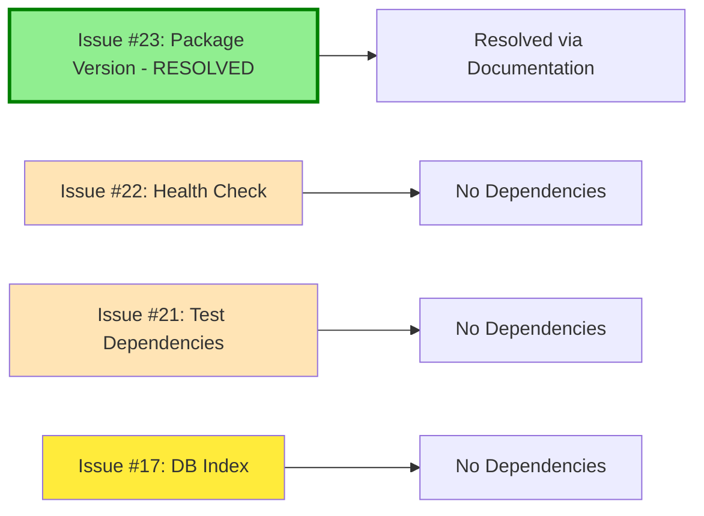
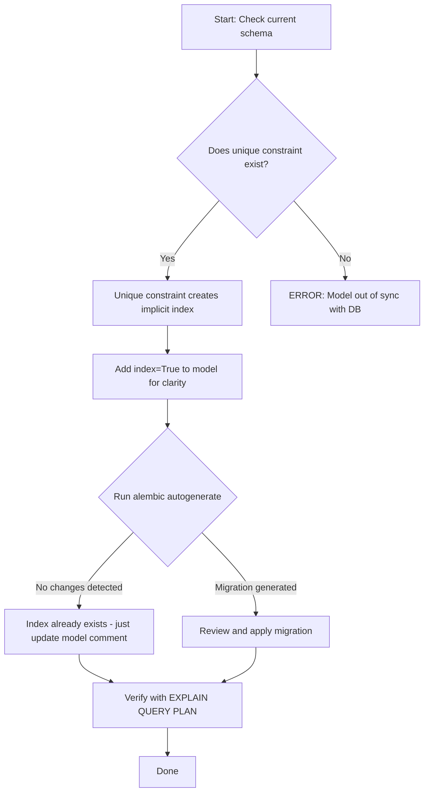

# Tech-Debt Resolution Plan

**Repository:** youtube-watcher
**Date Created:** 2026-01-19
**Target Executor:** LLM Agent
**Total Issues:** 4 (3 Pending, 1 Resolved)

---

## Table of Contents

1. [Overview](#overview)
2. [Completed Issues](#completed-issues)
3. [Issue Dependencies](#issue-dependencies)
4. [Execution Order](#execution-order)
5. [Issue #23: Update Frontend Package Version - RESOLVED](#issue-23-update-frontend-package-version---resolved)
6. [Issue #22: Enhance Health Check Endpoint](#issue-22-enhance-health-check-endpoint)
7. [Issue #21: Separate Test Dependencies](#issue-21-separate-test-dependencies)
8. [Issue #17: Verify YouTube Video ID Index](#issue-17-verify-youtube-video-id-index)
9. [Final Verification Checklist](#final-verification-checklist)

---

## Overview

This plan addresses 4 tech-debt issues in the youtube-watcher repository. Each issue is documented with:
- Current state analysis
- Step-by-step implementation instructions
- Exact code changes required
- Testing and verification steps
- Rollback procedures

**Status:**
- ✅ Resolved: 1 issue
- ⏳ Pending: 3 issues

**Complexity Legend:**
- 🟢 Low: Simple file edits, minimal risk
- 🟡 Medium: Requires careful implementation, moderate testing
- 🔴 High: Complex changes, extensive testing required

---

## Completed Issues

### Issue #23: Update Frontend Package Version - ✅ RESOLVED

**Resolution Date:** 2026-01-19
**Resolution Method:** Documentation Update

**Summary:**
Issue #23 has been resolved by updating the release process documentation in [`GITHUB_INTEGRATION.md`](GITHUB_INTEGRATION.md). The release workflow now explicitly requires running [`scripts/update_version.sh`](scripts/update_version.sh) before creating releases, which automatically updates [`frontend/package.json`](frontend/package.json:4) to match the release version.

**Resolution Details:**
- Updated [`GITHUB_INTEGRATION.md`](GITHUB_INTEGRATION.md) to document the version update step in the release process
- The existing [`scripts/update_version.sh`](scripts/update_version.sh) script already handles updating both repository version files
- When the documented release process is followed, the frontend package.json version will automatically be kept in sync
- This prevents Issue #23 from recurring in future releases

**Why This Resolves the Issue:**
The root cause of Issue #23 was not that the version needed to be manually updated, but that the release process didn't document the requirement to run the version update script. By explicitly documenting this step in the release workflow, the issue is prevented from recurring.

---

## Issue Dependencies



**Key Finding:** Issue #23 has been resolved through documentation updates. The remaining 3 issues are independent and can be executed in any order. However, the recommended order below optimizes for risk mitigation and logical grouping.

---

## Execution Order

| Order | Issue | Priority | Status | Complexity | Rationale |
|-------|-------|----------|--------|------------|-----------|
| ~~1~~ | ~~#23~~ | ~~Low~~ | ✅ **RESOLVED** | 🟢 Low | Resolved via documentation update |
| 1 | #21 | Low | ⏳ Pending | 🟢 Low | File creation with no runtime impact |
| 2 | #17 | Medium | ⏳ Pending | 🟡 Medium | Database investigation, may require migration |
| 3 | #22 | Low | ⏳ Pending | 🟢 Low | Code change with runtime impact, test last |

---

## Issue #23: Update Frontend Package Version - ✅ RESOLVED

**Priority:** Low - Documentation/Consistency
**Complexity:** 🟢 Low
**Impact:** Version consistency across project, proper semantic versioning
**Status:** ✅ **RESOLVED** (2026-01-19)

### Resolution

This issue has been **resolved through documentation updates** rather than manual code changes.

**Resolution Method:**
- Updated [`GITHUB_INTEGRATION.md`](GITHUB_INTEGRATION.md) to explicitly document the version update step in the release process
- The release workflow now requires running [`scripts/update_version.sh`](scripts/update_version.sh) before creating releases
- The version update script already exists and automatically updates [`frontend/package.json`](frontend/package.json:4) to match the release version
- This ensures version consistency is maintained automatically when following the documented release process

**Why This Approach:**
The root cause of this issue was not a missing code change, but a gap in the release process documentation. By documenting the existing version update script in the release workflow, we:
1. Prevent the issue from recurring in future releases
2. Leverage existing automation rather than creating manual work
3. Ensure all version files (root and frontend) are updated consistently
4. Make the release process more explicit and maintainable

**Verification:**
- [x] [`GITHUB_INTEGRATION.md`](GITHUB_INTEGRATION.md) updated with version update step
- [x] Release process explicitly requires running [`scripts/update_version.sh`](scripts/update_version.sh)
- [x] Script functionality verified to update [`frontend/package.json`](frontend/package.json:4)
- [x] Documentation prevents issue recurrence

### Original Issue Context (For Reference)

**Original State:** [`frontend/package.json`](frontend/package.json:4) line 4: `"version": "1.01"`

The version string `1.01` was not valid semantic versioning (semver). Semver requires the format `MAJOR.MINOR.PATCH`.

**Target State:** Version should match repository release version (e.g., `"version": "1.4.0"`)

**How It's Now Handled:**
When creating a new release, developers follow the documented process in [`GITHUB_INTEGRATION.md`](GITHUB_INTEGRATION.md), which includes running:
```bash
./scripts/update_version.sh <new_version>
```

This script automatically updates both the root version file and [`frontend/package.json`](frontend/package.json:4) to ensure consistency.

---

## Issue #22: Enhance Health Check Endpoint

**Priority:** Low - Operational Improvement  
**Complexity:** 🟢 Low  
**Impact:** Better monitoring, database connectivity verification, container orchestration support

### Current State

**File:** `backend/app/main.py`  
**Lines 56-58:**

```python
@app.get("/api/health")
async def health():
    return {"status": "ok"}
```

The current health check only returns a static response. It does not verify database connectivity.

### Target State

The health check should:
1. Attempt a database query
2. Return database connection status on success
3. Return HTTP 503 with error details on failure

### Step-by-Step Instructions

#### Step 1: Add Required Imports

**File to modify:** `backend/app/main.py`

**Location:** After line 7 (after the existing FastAPI imports)

Find this content (lines 4-9):
```python
from fastapi import FastAPI
from fastapi.staticfiles import StaticFiles
from fastapi.responses import FileResponse
from fastapi.middleware.cors import CORSMiddleware

from .routers import channels, videos, import_export, settings
```

Replace with:
```python
from fastapi import FastAPI, Depends, HTTPException
from fastapi.staticfiles import StaticFiles
from fastapi.responses import FileResponse
from fastapi.middleware.cors import CORSMiddleware
from sqlalchemy import text
from sqlalchemy.ext.asyncio import AsyncSession

from .routers import channels, videos, import_export, settings
from .database import get_db
```

**Changes made:**
- Added `Depends` and `HTTPException` to FastAPI import
- Added `text` import from sqlalchemy
- Added `AsyncSession` import from sqlalchemy.ext.asyncio
- Added `get_db` import from database module

#### Step 2: Update the Health Check Endpoint

**File to modify:** `backend/app/main.py`

Find this content (lines 56-58):
```python
@app.get("/api/health")
async def health():
    return {"status": "ok"}
```

Replace with:
```python
@app.get("/api/health")
async def health(db: AsyncSession = Depends(get_db)):
    """
    Health check endpoint that verifies database connectivity.
    
    Returns:
        - 200 OK with status and database connection info on success
        - 503 Service Unavailable if database connection fails
    """
    try:
        await db.execute(text("SELECT 1"))
        return {"status": "ok", "database": "connected"}
    except Exception as e:
        raise HTTPException(
            status_code=503,
            detail="Service unavailable: database connection failed"
        )
```

### Complete Modified File Reference

After all changes, the top of `backend/app/main.py` should look like:

```python
from contextlib import asynccontextmanager
import os

from fastapi import FastAPI, Depends, HTTPException
from fastapi.staticfiles import StaticFiles
from fastapi.responses import FileResponse
from fastapi.middleware.cors import CORSMiddleware
from sqlalchemy import text
from sqlalchemy.ext.asyncio import AsyncSession

from .routers import channels, videos, import_export, settings
from .database import get_db


@asynccontextmanager
async def lifespan(app: FastAPI):
    # Startup: Ensure the data directory exists
    os.makedirs("data", exist_ok=True)
    yield
    # Shutdown: nothing to clean up
```

And the health check endpoint (around line 56) should look like:

```python
@app.get("/api/health")
async def health(db: AsyncSession = Depends(get_db)):
    """
    Health check endpoint that verifies database connectivity.
    
    Returns:
        - 200 OK with status and database connection info on success
        - 503 Service Unavailable if database connection fails
    """
    try:
        await db.execute(text("SELECT 1"))
        return {"status": "ok", "database": "connected"}
    except Exception as e:
        raise HTTPException(
            status_code=503,
            detail="Service unavailable: database connection failed"
        )
```

### Testing

#### Test 1: Verify Syntax

```bash
cd backend && python -m py_compile app/main.py && echo "Syntax OK"
```

**Expected output:**
```
Syntax OK
```

#### Test 2: Start the Application and Test Endpoint

```bash
# Start the development environment
docker compose -f docker-compose.dev.yml up -d

# Wait for startup
sleep 5

# Test the health endpoint
curl -s http://localhost:8000/api/health | python -m json.tool
```

**Expected output (success case):**
```json
{
    "status": "ok",
    "database": "connected"
}
```

#### Test 3: Verify Database Failure Handling (Optional)

To test the failure case, you would need to temporarily break the database connection. This is optional and can be verified through code review.

### Verification Checklist

- [ ] `backend/app/main.py` has updated imports (Depends, HTTPException, text, AsyncSession, get_db)
- [ ] Health check endpoint accepts `db` parameter with `Depends(get_db)`
- [ ] Health check executes `SELECT 1` query
- [ ] Health check returns `{"status": "ok", "database": "connected"}` on success
- [ ] Health check raises `HTTPException(status_code=503)` on database failure
- [ ] Application starts without errors
- [ ] Endpoint returns expected response when called

### Rollback Procedure

If rollback is needed:

1. Revert the imports in `backend/app/main.py` to:
```python
from fastapi import FastAPI
from fastapi.staticfiles import StaticFiles
from fastapi.responses import FileResponse
from fastapi.middleware.cors import CORSMiddleware

from .routers import channels, videos, import_export, settings
```

2. Revert the health check endpoint to:
```python
@app.get("/api/health")
async def health():
    return {"status": "ok"}
```

---

## Issue #21: Separate Test Dependencies

**Priority:** Low - Code Quality Improvement  
**Complexity:** 🟢 Low  
**Impact:** Smaller production Docker image, clearer dependency separation, faster production builds

### Current State

**File:** `backend/requirements.txt`

```
fastapi>=0.115.0
uvicorn[standard]>=0.27.0
sqlalchemy>=2.0.25
alembic>=1.13.1
pydantic>=2.10.0
pydantic-settings>=2.1.0
httpx>=0.26.0
feedparser>=6.0.10
python-multipart>=0.0.18
aiosqlite>=0.19.0
tenacity>=8.2.0
pytest==7.4.4
pytest-asyncio==0.23.3
```

Test dependencies (`pytest` and `pytest-asyncio`) are mixed with production dependencies.

### Target State

1. **Production requirements** (`backend/requirements.txt`): Only production dependencies
2. **Development requirements** (`backend/requirements-dev.txt`): Test dependencies + reference to production
3. **Dockerfile**: Uses only production requirements
4. **Dockerfile.dev**: Uses development requirements

### Step-by-Step Instructions

#### Step 1: Modify Production Requirements

**File to modify:** `backend/requirements.txt`

Find this content (entire file):
```
fastapi>=0.115.0
uvicorn[standard]>=0.27.0
sqlalchemy>=2.0.25
alembic>=1.13.1
pydantic>=2.10.0
pydantic-settings>=2.1.0
httpx>=0.26.0
feedparser>=6.0.10
python-multipart>=0.0.18
aiosqlite>=0.19.0
tenacity>=8.2.0
pytest==7.4.4
pytest-asyncio==0.23.3
```

Replace with:
```
fastapi>=0.115.0
uvicorn[standard]>=0.27.0
sqlalchemy>=2.0.25
alembic>=1.13.1
pydantic>=2.10.0
pydantic-settings>=2.1.0
httpx>=0.26.0
feedparser>=6.0.10
python-multipart>=0.0.18
aiosqlite>=0.19.0
tenacity>=8.2.0
```

**Change:** Removed the last two lines (`pytest==7.4.4` and `pytest-asyncio==0.23.3`)

#### Step 2: Create Development Requirements File

**File to create:** `backend/requirements-dev.txt`

**Content:**
```
# Development dependencies for youtube-watcher backend
# Install with: pip install -r requirements-dev.txt

# Include all production dependencies
-r requirements.txt

# Testing frameworks
pytest==7.4.4
pytest-asyncio==0.23.3
```

#### Step 3: Update Development Dockerfile

**File to modify:** `Dockerfile.dev`

Find this content (entire file):
```dockerfile
FROM python:3.11-slim
WORKDIR /app

# Install sqlite3 and upgrade pip
RUN apt-get update && apt-get install -y sqlite3 && pip install --upgrade pip

COPY backend/requirements.txt .
RUN pip install --no-cache-dir -r requirements.txt pip-audit
```

Replace with:
```dockerfile
FROM python:3.11-slim
WORKDIR /app

# Install sqlite3 and upgrade pip
RUN apt-get update && apt-get install -y sqlite3 && pip install --upgrade pip

# Copy both requirement files for development
COPY backend/requirements.txt backend/requirements-dev.txt ./

# Install development dependencies (includes production deps via -r)
RUN pip install --no-cache-dir -r requirements-dev.txt pip-audit
```

**Changes made:**
- Copy both `requirements.txt` and `requirements-dev.txt`
- Install from `requirements-dev.txt` instead of `requirements.txt`

#### Step 4: Verify Production Dockerfile (No Changes Required)

**File:** `Dockerfile`

The production Dockerfile already only references `requirements.txt`:

```dockerfile
# Install Python dependencies
COPY backend/requirements.txt .
RUN pip install --no-cache-dir -r requirements.txt
```

This is correct. No changes needed.

#### Step 5: Update README.md with Development Instructions

**File to modify:** `README.md`

Find this content (around lines 55-65):
```markdown
### Development Mode

For development with hot reload:

```bash
docker compose -f docker-compose.dev.yml up --build
```

- Frontend: http://localhost:5173
- Backend API: http://localhost:8000
- API Documentation: http://localhost:8000/docs
```

Replace with:
```markdown
### Development Mode

For development with hot reload:

```bash
docker compose -f docker-compose.dev.yml up --build
```

- Frontend: http://localhost:5173
- Backend API: http://localhost:8000
- API Documentation: http://localhost:8000/docs

#### Running Tests

Tests require development dependencies. When using Docker:

```bash
# Run tests in the development container
docker compose -f docker-compose.dev.yml exec backend pytest
```

For local development without Docker:

```bash
cd backend
pip install -r requirements-dev.txt
pytest
```
```

### Testing

#### Test 1: Verify requirements.txt Has No Test Dependencies

```bash
grep -E "pytest" backend/requirements.txt
```

**Expected output:** No output (empty result)

#### Test 2: Verify requirements-dev.txt Exists and Has Correct Content

```bash
cat backend/requirements-dev.txt
```

**Expected output:**
```
# Development dependencies for youtube-watcher backend
# Install with: pip install -r requirements-dev.txt

# Include all production dependencies
-r requirements.txt

# Testing frameworks
pytest==7.4.4
pytest-asyncio==0.23.3
```

#### Test 3: Build Production Docker Image

```bash
docker build -t youtube-watcher-prod-test .
```

**Expected:** Build succeeds without pytest

#### Test 4: Verify pytest NOT in Production Image

```bash
docker run --rm youtube-watcher-prod-test pip list | grep pytest
```

**Expected output:** No output (pytest not installed)

#### Test 5: Build Development Docker Image

```bash
docker build -f Dockerfile.dev -t youtube-watcher-dev-test .
```

**Expected:** Build succeeds with pytest

#### Test 6: Verify pytest IS in Development Image

```bash
docker run --rm youtube-watcher-dev-test pip list | grep pytest
```

**Expected output:**
```
pytest             7.4.4
pytest-asyncio     0.23.3
```

#### Test 7: Run Tests in Development Container

```bash
docker compose -f docker-compose.dev.yml up -d
docker compose -f docker-compose.dev.yml exec backend pytest --collect-only
```

**Expected:** Test collection succeeds, showing discovered tests

### Verification Checklist

- [ ] `backend/requirements.txt` does NOT contain `pytest` or `pytest-asyncio`
- [ ] `backend/requirements-dev.txt` exists with correct content
- [ ] `backend/requirements-dev.txt` includes `-r requirements.txt`
- [ ] `backend/requirements-dev.txt` includes `pytest==7.4.4` and `pytest-asyncio==0.23.3`
- [ ] `Dockerfile.dev` copies both requirement files
- [ ] `Dockerfile.dev` installs from `requirements-dev.txt`
- [ ] Production Docker build succeeds
- [ ] Production image does NOT have pytest installed
- [ ] Development Docker build succeeds
- [ ] Development image HAS pytest installed
- [ ] Tests run successfully in development container
- [ ] README.md updated with test running instructions

### Rollback Procedure

If rollback is needed:

1. Delete `backend/requirements-dev.txt`

2. Restore `backend/requirements.txt` to:
```
fastapi>=0.115.0
uvicorn[standard]>=0.27.0
sqlalchemy>=2.0.25
alembic>=1.13.1
pydantic>=2.10.0
pydantic-settings>=2.1.0
httpx>=0.26.0
feedparser>=6.0.10
python-multipart>=0.0.18
aiosqlite>=0.19.0
tenacity>=8.2.0
pytest==7.4.4
pytest-asyncio==0.23.3
```

3. Restore `Dockerfile.dev` to:
```dockerfile
FROM python:3.11-slim
WORKDIR /app

# Install sqlite3 and upgrade pip
RUN apt-get update && apt-get install -y sqlite3 && pip install --upgrade pip

COPY backend/requirements.txt .
RUN pip install --no-cache-dir -r requirements.txt pip-audit
```

4. Revert README.md changes (remove the "Running Tests" section)

---

## Issue #17: Verify YouTube Video ID Index

**Priority:** Medium - Technical Debt  
**Complexity:** 🟡 Medium  
**Impact:** Query performance for video lookups by YouTube ID, database optimization

### Current State

**File:** `backend/app/models/video.py`  
**Line 10:**

```python
youtube_video_id = Column(String, unique=True, nullable=False)
```

The column has a `unique=True` constraint but no explicit `index=True` declaration.

### Background: Unique Constraints and Indexes

In SQLite (and most databases), a `UNIQUE` constraint automatically creates an implicit index to enforce uniqueness efficiently. However:

1. **Implicit vs Explicit:** The index exists but isn't explicitly documented in the model
2. **Code Clarity:** Adding explicit `index=True` makes the indexing intention clear
3. **Documentation:** Comments help future developers understand the design decision

### Investigation Required

Before making changes, verify the current database state.

#### Step 1: Check Current Database Schema

Run this command to inspect the SQLite database:

```bash
docker compose -f docker-compose.dev.yml exec backend sqlite3 /app/data/youtube-watcher.db ".schema videos"
```

**Expected output will show one of:**

**Case A - Unique constraint creates implicit index:**
```sql
CREATE TABLE videos (
    ...
    youtube_video_id VARCHAR NOT NULL,
    ...
    UNIQUE (youtube_video_id)
);
```

**Case B - Explicit index exists:**
```sql
CREATE TABLE videos (
    ...
    youtube_video_id VARCHAR NOT NULL,
    ...
);
CREATE INDEX ix_videos_youtube_video_id ON videos (youtube_video_id);
```

#### Step 2: Check for Existing Indexes

```bash
docker compose -f docker-compose.dev.yml exec backend sqlite3 /app/data/youtube-watcher.db ".indexes videos"
```

**Expected output:** List of indexes on the videos table. Look for anything containing `youtube_video_id`.

#### Step 3: Query SQLite Master Table

```bash
docker compose -f docker-compose.dev.yml exec backend sqlite3 /app/data/youtube-watcher.db "SELECT name, sql FROM sqlite_master WHERE type='index' AND tbl_name='videos';"
```

This shows all indexes and their SQL definitions.

### Implementation: Add Explicit Index to Model

Regardless of the investigation results, add explicit `index=True` for code clarity. SQLAlchemy handles duplicate index definitions gracefully.

#### Step 4: Update the Video Model

**File to modify:** `backend/app/models/video.py`

Find this content (lines 1-11):
```python
import uuid
from sqlalchemy import Column, String, DateTime, func, ForeignKey
from sqlalchemy.orm import relationship
from ..database import Base

class Video(Base):
    __tablename__ = "videos"

    id = Column(String, primary_key=True, default=lambda: str(uuid.uuid4()))
    youtube_video_id = Column(String, unique=True, nullable=False)
    channel_id = Column(String, ForeignKey("channels.id", ondelete="CASCADE"))
```

Replace with:
```python
import uuid
from sqlalchemy import Column, String, DateTime, func, ForeignKey
from sqlalchemy.orm import relationship
from ..database import Base

class Video(Base):
    __tablename__ = "videos"

    id = Column(String, primary_key=True, default=lambda: str(uuid.uuid4()))
    # Index on youtube_video_id for efficient lookups by YouTube video ID
    # Note: unique=True creates an implicit index, but explicit index=True
    # ensures clarity and allows SQLAlchemy to manage the index explicitly
    youtube_video_id = Column(String, unique=True, nullable=False, index=True)
    channel_id = Column(String, ForeignKey("channels.id", ondelete="CASCADE"))
```

**Changes made:**
- Added comment explaining the index decision
- Added `index=True` to the column definition

#### Step 5: Generate Alembic Migration (If Needed)

After updating the model, check if Alembic detects any changes:

```bash
docker compose -f docker-compose.dev.yml exec backend alembic revision --autogenerate -m "add_explicit_index_to_youtube_video_id"
```

**Possible outcomes:**

**Outcome A - No changes detected:**
Alembic output will say "No changes in schema detected." This means the unique constraint already created an index and SQLAlchemy recognizes it. In this case:
- Delete the empty migration file if one was created
- The model change is purely documentation

**Outcome B - New index migration generated:**
Review the generated migration file in `backend/alembic/versions/`. It should contain:

```python
def upgrade():
    op.create_index(op.f('ix_videos_youtube_video_id'), 'videos', ['youtube_video_id'], unique=True)

def downgrade():
    op.drop_index(op.f('ix_videos_youtube_video_id'), table_name='videos')
```

If this migration is generated, apply it:

```bash
docker compose -f docker-compose.dev.yml exec backend alembic upgrade head
```

#### Step 6: Verify Index Exists

After any changes, verify the index:

```bash
docker compose -f docker-compose.dev.yml exec backend sqlite3 /app/data/youtube-watcher.db "EXPLAIN QUERY PLAN SELECT * FROM videos WHERE youtube_video_id = 'test123';"
```

**Expected output should show index usage:**
```
SEARCH videos USING INDEX ... (youtube_video_id=?)
```

### Decision Tree



### Testing

#### Test 1: Verify Model Syntax

```bash
cd backend && python -c "from app.models.video import Video; print('Model loads successfully')"
```

**Expected output:**
```
Model loads successfully
```

#### Test 2: Verify Application Starts

```bash
docker compose -f docker-compose.dev.yml up -d
curl -s http://localhost:8000/api/health
```

**Expected:** Health check returns OK

#### Test 3: Verify Index Performance

```bash
docker compose -f docker-compose.dev.yml exec backend sqlite3 /app/data/youtube-watcher.db "EXPLAIN QUERY PLAN SELECT * FROM videos WHERE youtube_video_id = 'dQw4w9WgXcQ';"
```

**Expected:** Output shows index is being used (contains "USING INDEX")

#### Test 4: Run Existing Tests

```bash
docker compose -f docker-compose.dev.yml exec backend pytest
```

**Expected:** All tests pass

### Verification Checklist

- [ ] Investigated current database schema
- [ ] Documented whether unique constraint created implicit index
- [ ] Updated `backend/app/models/video.py` with `index=True`
- [ ] Added explanatory comment to the model
- [ ] Generated Alembic migration if needed
- [ ] Applied migration if generated
- [ ] Verified index exists using EXPLAIN QUERY PLAN
- [ ] Application starts without errors
- [ ] All existing tests pass

### Rollback Procedure

If rollback is needed:

1. If a migration was applied, run:
```bash
docker compose -f docker-compose.dev.yml exec backend alembic downgrade -1
```

2. Delete the migration file from `backend/alembic/versions/`

3. Revert `backend/app/models/video.py` line 10 to:
```python
    youtube_video_id = Column(String, unique=True, nullable=False)
```

---

## Final Verification Checklist

After completing all remaining issues, verify the following:

### Issue #23: Frontend Package Version - ✅ RESOLVED
- [x] [`GITHUB_INTEGRATION.md`](GITHUB_INTEGRATION.md) updated with version update step
- [x] Release process documents running [`scripts/update_version.sh`](scripts/update_version.sh)
- [x] Script verified to update [`frontend/package.json`](frontend/package.json:4) automatically
- [x] Issue resolution prevents recurrence

### Issue #22: Health Check Enhancement
- [ ] Health endpoint returns `{"status": "ok", "database": "connected"}`
- [ ] Health endpoint returns 503 when database is unavailable

### Issue #21: Test Dependencies Separation
- [ ] `backend/requirements.txt` has no pytest dependencies
- [ ] `backend/requirements-dev.txt` exists and includes pytest
- [ ] Production Docker image builds without pytest
- [ ] Development Docker image builds with pytest
- [ ] Tests run in development container

### Issue #17: YouTube Video ID Index
- [ ] Model has explicit `index=True` on `youtube_video_id`
- [ ] Index is verified in database
- [ ] All tests pass

### Full System Verification

After all changes:

```bash
# Stop any running containers
docker compose -f docker-compose.dev.yml down

# Rebuild and start development environment
docker compose -f docker-compose.dev.yml up --build -d

# Wait for startup
sleep 10

# Test health endpoint
curl -s http://localhost:8000/api/health

# Run all tests
docker compose -f docker-compose.dev.yml exec backend pytest

# Build production image
docker compose down
docker compose up --build -d

# Test production health endpoint
curl -s http://localhost:38000/api/health
```

**All commands should succeed with expected output.**

---

## Summary

| Issue | Status | Files Modified | Files Created | Complexity |
|-------|--------|---------------|---------------|------------|
| #23 | ✅ Resolved | `GITHUB_INTEGRATION.md` | None | 🟢 Low |
| #22 | ⏳ Pending | `backend/app/main.py` | None | 🟢 Low |
| #21 | ⏳ Pending | `backend/requirements.txt`, `Dockerfile.dev`, `README.md` | `backend/requirements-dev.txt` | 🟢 Low |
| #17 | ⏳ Pending | `backend/app/models/video.py` | Possibly migration file | 🟡 Medium |

**Completed:** 1 issue
**Remaining:** 3 issues
**Total estimated files to modify (for remaining issues):** 4-5
**Total estimated files to create (for remaining issues):** 1-2

---

*End of Tech-Debt Resolution Plan*
